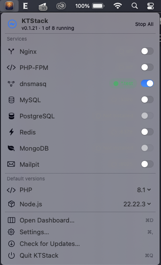
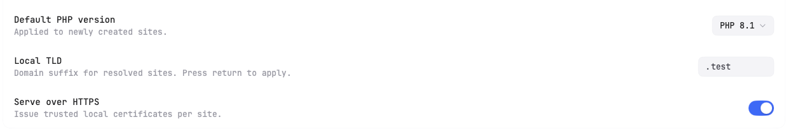
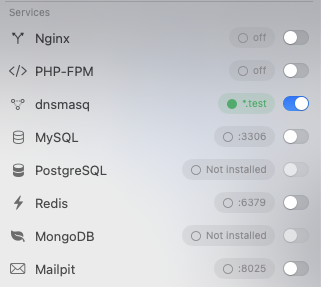

# 01 — Install and First Run

This page walks you through downloading and installing KTStack on your Mac, then handling the one-time setup that makes local DNS work.

## Installation

1. Download the latest KTStack release from [GitHub Releases](https://github.com/KTStackAPP/KTStack/releases).
2. Open your **Downloads** folder and find the `.dmg` file (the installer disk image).
3. Double-click the `.dmg` to mount it. A window will open showing the KTStack icon.
4. Drag the KTStack icon into the **Applications** folder shortcut shown in the window.
5. Wait for the copy process to complete, then close the installer window.

You can now eject the `.dmg` from your desktop.

## Launching KTStack

1. Open **Finder** and go to **Applications**.
2. Find **KTStack** and double-click it to launch the app.
3. KTStack appears as a menu-bar icon (a lightning bolt circle, shown in the top-right corner of your menu bar). The app has no dock icon — it lives quietly in your menu bar.
4. On first launch, you may see a system prompt asking to allow KTStack. Click **Open** to proceed.

## One-Time DNS Setup

When KTStack starts for the first time, you'll see a prompt to enable automatic DNS for local sites. This is required to make `*.test` domains resolve on your Mac.

### What happens during DNS setup

KTStack needs to:
- Install a small privileged helper (runs as root, only used for DNS)
- Write a DNS resolver configuration to your Mac
- Start a DNS service (dnsmasq) on port 53

macOS will ask for your **administrator password** once during this process. After that, KTStack never needs your password again.

### Enabling DNS

1. Click the **Enable DNS** button in the setup prompt.
2. macOS will ask for your **admin password**. Enter it.
3. If you see a System Settings window asking to allow a new login item, click **Allow** to let KTStack's helper run in the background.
4. KTStack will start the DNS service. Wait for the prompt to complete.

If you skip this step (clicking **Not now**), you can enable DNS later through the menu bar or dashboard.

## DNS Status

After setup, you will see a DNS status bar in the menu bar or dashboard. It shows one of three states:

| Status | Meaning | Action |
|--------|---------|--------|
| ✅ **Enabled** | DNS is active; `*.test` domains work. | You can disable or reset it if needed. |
| ⚠️ **Conflict** | Another service is using port 53 (DNS port). | Click **Reset** to troubleshoot, or stop the conflicting service. |
| 🔲 **Disabled** | DNS is off; `*.test` domains won't resolve. | Click **Enable DNS** to turn it back on. |

## Checking Services on First Launch

After DNS is enabled, KTStack will start essential services automatically. You will see a status message in the menu bar showing how many services are running (for example, "2 of 8 running").

From the menu bar:
1. Click the **KTStack icon** (lightning bolt).
2. Look at the header that shows "KTStack · X of Y running".
3. Each service (Nginx, PHP-FPM, MySQL, and so on) is listed with a **toggle** on the right.
4. A green dot (●) means the service is running. A gray dot means it is stopped.

Services start automatically based on your settings. You do not need to start them manually unless you stopped them earlier.

## Auto-Resize Dashboard

The first time you open the dashboard, KTStack adjusts the window size to fit your screen comfortably. The window remembers its size and position on future launches, so you can resize it as you like.

## Where to go next

Now that KTStack is installed and DNS is enabled, head to [02 — Interface overview](02-interface-overview.md) to explore the menu bar and dashboard, then [03 — Managing sites](03-managing-sites.md) to create your first site.

### Troubleshooting first launch

- **"Permission denied" when enabling DNS?** Make sure you entered your admin password correctly. If it fails again, click **Reset** and try once more.
- **"Port conflict" error?** Another service on your Mac is using port 53 (DNS). Check System Preferences > Network, or run `lsof -i :53` in Terminal to see what is using it.
- **DNS is still "disabled" after setup?** Wait a few seconds for the service to start. If it stays disabled, restart KTStack.
