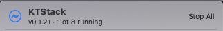
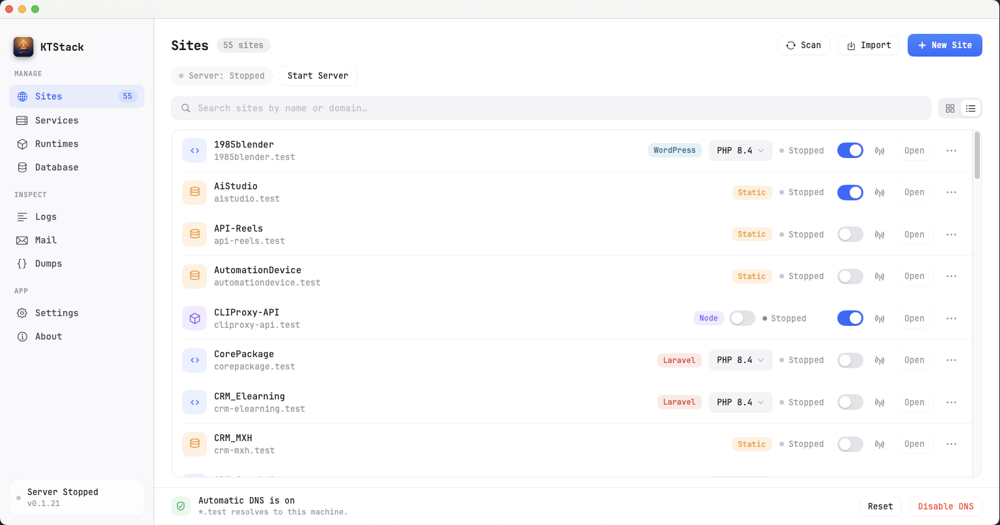

# 02 — Interface Overview

KTStack has two main interfaces: the **menu bar** (for quick access and controls) and the **dashboard** (the main window with all your sites, services, and tools). This page explains both.

## Menu Bar

The menu bar is where you go for quick actions. Click the KTStack icon (lightning bolt ⚡) in your menu bar to see it.

### Header

At the top of the menu, you see:
- **KTStack icon and title**
- **Version number and service count** (for example, "v0.1.0 · 3 of 8 running")
- **Start All / Stop All button** — toggles all services at once

### Services Section

Below the header is a list of all services KTStack manages. Each service shows:
- **Icon and name** (Nginx, PHP-FPM, MySQL, PostgreSQL, Redis, MongoDB, Mailpit, dnsmasq)
- **Status pill** — shows "Running", "Stopped", "Not installed", or port details
- **Toggle switch** — turn the service on or off
- **Progress indicator** — if the service is starting or stopping, you'll see a spinning circle

To control a service:
1. Find it in the list.
2. Click the **toggle switch** on the right to start or stop it.
3. If the service is not installed, the toggle is disabled (grayed out). You'll need to install it from the **Runtimes** section of the dashboard.

### Footer

At the bottom of the menu bar are four buttons:

| Button | Shortcut | What it does |
|--------|----------|--------------|
| **Open Dashboard…** | ⌘D | Opens the main dashboard window. If the window is already open, brings it to the front. |
| **Settings…** | ⌘, | Opens KTStack settings (TLD, sites root, update preferences, and more). |
| **Check for Updates** | — | Checks GitHub for a newer version of KTStack. |
| **Quit KTStack** | ⌘Q | Closes KTStack completely. Services continue running. |

## Dashboard

The dashboard is your main workspace. Open it by clicking **Open Dashboard** from the menu bar, or pressing **⌘D**.

### Layout

The dashboard has two main sections side by side:

1. **Left sidebar** — navigation and top-level info
2. **Right content area** — the currently selected section (Sites, Services, Logs, Database, and so on)

The dashboard remembers its size and position. You can resize or move it as needed.

### Sidebar Navigation

The left sidebar has three groups of buttons:

#### MANAGE group

These sections let you create and configure everything:

- **Sites** — create, import, edit, and remove local development sites. Shows a badge with the number of sites you have.
- **Services** — start, stop, and manage background processes (Nginx, databases, mail, and so on).
- **Runtimes** — install and configure PHP and Node versions.
- **Database** — browse and edit your databases (MySQL, PostgreSQL, SQLite, MongoDB) with a SQL editor, ER diagrams, and backup tools.

#### INSPECT group

These read-only sections help you debug and monitor:

- **Logs** — live tail of logs from Nginx, PHP-FPM, databases, and other services. Pick which service to watch.
- **Mail** — inbox for Mailpit, the built-in email capture tool. See all mail sent by your apps.
- **Dumps** — captured output from `dump()` and `dd()` calls in your PHP code.

#### APP group

- **Settings** — KTStack preferences (TLD, sites root path, update channel).
- **About** — version info and links.

### Content Area (Right Panel)

The content area changes depending which sidebar item you selected. Common features across sections include:

- **Search box** (if applicable) — quickly find a site, service, or log entry
- **Grid / List view toggle** (for Sites) — switch between a card grid and a compact list
- **Action buttons** — create, import, scan, download, and other section-specific actions
- **Row actions** — click buttons or menu icons (⋯) on individual items for per-item controls

## Common Dashboard Actions

### Switching Sections

Click any item in the left sidebar to navigate to that section. The content on the right updates instantly.

### Finding Items

Most sections have a search box at the top:
1. Click in the search field.
2. Type a name, domain, or keyword.
3. Results update live as you type.

### Grid vs. List View (Sites Only)

The **Sites** section has a toggle in the header to switch between two views:

- **Grid view** — cards showing site name, domain, type, and quick actions. Good for visual browsing.
- **List view** — compact rows with more details visible at once. Good for many sites.

Click the **grid icon** or **list icon** in the toolbar to switch.

### Opening Context Menus

Many items have a **⋯ menu** (three dots) button. Click it to see actions like:
- Open in browser
- Edit domain
- View logs
- Remove item

The menu closes when you click an action or click elsewhere.

## Status and Indicators

Throughout the dashboard, you'll see colored dots and status pills:

| Indicator | Meaning |
|-----------|---------|
| 🟢 Green dot (●) | Service or process is running and healthy. |
| 🔴 Red dot (●) | Service has crashed or is stopped. |
| 🟡 Yellow dot (●) | Service is warning state (e.g., high CPU, port conflict). |
| **Running** pill | Service is active. |
| **Stopped** pill | Service is turned off. |
| **Not installed** pill | Requires download before use. |

## Keyboard Shortcuts

| Shortcut | Action |
|----------|--------|
| **⌘D** | Open or focus the dashboard |
| **⌘,** | Open Settings |
| **⌘Q** | Quit KTStack |
| **⌘O** | Open selected site in browser (in Sites section) |
| **⇧⌘R** | Reveal selected site in Finder (in Sites section) |
| **⌘L** | View logs for selected site (in Sites section) |
| **⌘⫶** | Remove selected site (in Sites section) |

## Window Management

- **Auto-resize on first launch** — KTStack sizes the dashboard to fit your screen.
- **Position and size persist** — the dashboard remembers where you left it.
- **Always-on-top window** — the dashboard stays visible when you switch to other apps (you can configure this in Settings if needed).
- **Native macOS windowing** — use ⌘ to move, resize, or minimize like any other Mac app.

## Where to go next

Now that you understand the layout, head to [03 — Managing sites](03-managing-sites.md) to create your first local development site.
