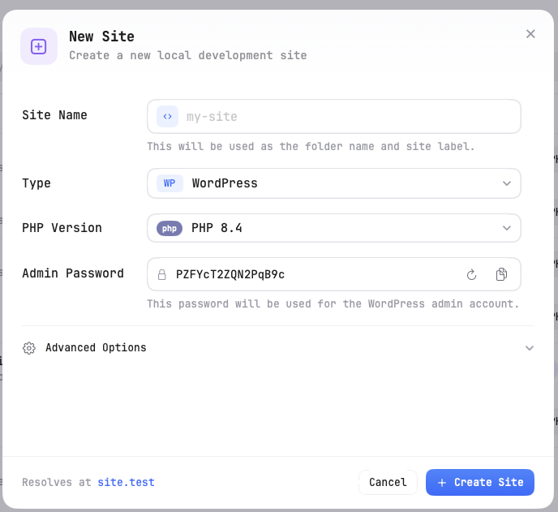
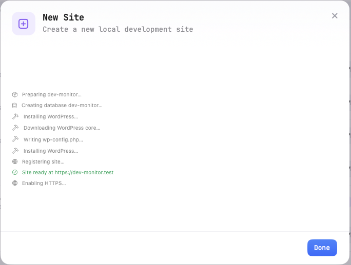
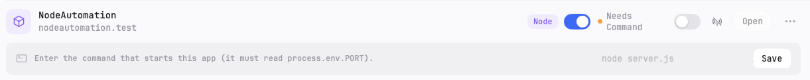

# 03 — Managing Sites

This page walks you through creating, importing, and managing local development sites in KTStack. A **site** is a project folder that KTStack serves at a `*.test` domain with automatic HTTPS and your chosen PHP or Node version.

## Create a New Site

Creating a new site takes about 30 seconds. KTStack sets up the folder structure, web server routing, and optional database automatically.

### Open the New Site Dialog

1. Click the **KTStack icon** in the menu bar (or press **⌘D** to open the dashboard).
2. Click the **Sites** section in the left sidebar.
3. Click the **New Site** button (usually a **+** icon) at the top of the Sites section.
4. A modal dialog appears with a form.

### Fill in the Form

The new site form has several fields:

#### Site Name

1. Click the **Site Name** field.
2. Enter a folder name for your project (for example, `my-blog` or `api-server`).
3. This name will be used as the folder name inside your sites root directory and as the label in KTStack.

#### Type

Choose what kind of site you are creating:

| Type | What it runs | When to choose |
|------|------|---------|
| **WordPress** | PHP + MySQL database | You want a WordPress installation. KTStack creates the DB and sets admin credentials. |
| **Laravel** | PHP + optional MySQL | You want a Laravel app. KTStack detects it and shows a Laravel badge. |
| **Plain PHP** | PHP + optional MySQL | Standard PHP app (Symfony, Drupal, custom code, or plain `index.php`). |
| **Node** | Node.js process | You have a Node.js app (Express, Next.js, Nuxt, etc.). You provide the start command. |

To select a type:
1. Click the **Type** dropdown.
2. Select the type you want.
3. The form updates to show type-specific options.

#### PHP Version

If you chose PHP (WordPress, Laravel, or Plain), select which PHP version to use:

1. Click the **PHP Version** dropdown.
2. Choose a version from the installed list (for example, PHP 8.3, PHP 8.2).
3. If you do not see a version you need, go to the **Runtimes** section of the dashboard to install more.

This can be changed per-site later.

#### Admin Password

For WordPress sites, KTStack generates a random admin password. You can:
- **Keep it** — click the copy icon (📋) to copy it to your clipboard.
- **Regenerate it** — click the circular arrow (↻) to get a new one.

This password is used for the WordPress admin account.

### Advanced Options

Expand the **Advanced Options** section to configure:

#### Serve over HTTPS

By default, enabled. Your site will be served at `https://site.test` with a browser-trusted local certificate. You can disable this to serve over HTTP only (not recommended).

#### Create Database

By default, enabled. KTStack will create a matching MySQL database for you (name = site folder name). Disable if you do not need a database.

### Create the Site

1. Review the form. By default, the site will be created at `https://my-site.test` (adjusting the domain based on your TLD setting).
2. Click the **Create** button.
3. A progress overlay appears showing what KTStack is doing (creating folders, installing WordPress, setting up PHP pool, etc.).
4. When complete, your site appears in the Sites list.

The site is now running and accessible in your browser at the shown domain.

## Open a Site in Your Browser

Once a site is created, open it in your default browser:

1. In the **Sites** section, find the site you want to open.
2. Hover over the site card or row.
3. Click **Open in Browser** (or press **⌘O** if the site is selected).
4. Your browser opens to `https://site.test`.

If you get a certificate warning, your browser does not yet trust KTStack's local CA. See [05 — HTTPS & certificates](05-https-and-certificates.md) for instructions on trusting it.

## Import or Scan for Existing Sites

If you already have projects in your sites root folder, KTStack can import them automatically.

### Scan for Existing Sites

Scanning finds existing folders and detects what type of site each one is.

1. In the **Sites** section, click the **Scan** button (🔍 icon).
2. KTStack scans your sites root directory.
3. Any folders it finds are listed with type detection (WordPress, Laravel, Node, or plain PHP).
4. Select the sites you want to import (checkboxes or select all).
5. Click **Import**.
6. KTStack creates entries for each site and starts them.

### Add an Existing Folder

If you have a folder outside your sites root, add it manually:

1. In the **Sites** section, click **Add Existing** (📂 icon).
2. A file browser opens.
3. Navigate to the folder you want (can be anywhere on your Mac).
4. Click **Select**.
5. A form appears asking for site details (name, type, PHP version if needed).
6. Fill it in and click **Add**.
7. KTStack creates the site entry and starts it.

## Edit a Site

### Change the Domain

1. Hover over the site in the list.
2. Click in the **domain field** (shows `site-name.test` by default).
3. Type a new domain (for example, `myapp.local` or `custom-domain.test`).
4. Press **Enter** to save.

The domain must be unique among your sites. If you get an error, try a different name.

### Change PHP Version

For PHP sites only:

1. Hover over the site in the list.
2. Click the **PHP version button** on the right (for example, "PHP 8.3").
3. Select a different version from the dropdown.
4. KTStack switches the site to that version instantly.

### Toggle HTTPS

For PHP sites only:

1. Find the site in the list.
2. Click the **lock icon** (🔒) to toggle HTTPS on/off.
3. Green lock = HTTPS enabled. Gray lock = HTTP only.

## Enable Node for a Site

If you have a Node.js app running alongside PHP (or a pure Node site), you can enable Node serving:

### Prerequisites

- Node.js must be installed. See [04 — PHP & runtimes](04-php-and-runtimes.md) to download it.
- Your site must be a Node or static site type.

### Steps

1. Find the site in the Sites list.
2. Look for a **Node toggle** (usually labeled "Run Node app").
3. Click the toggle to enable Node.
4. A **Node banner** appears showing what is needed:

   - **"Node runtime is not installed"** — click **Download Node** to install it from Runtimes.
   - **"Enter the command that starts this app"** — you must tell KTStack how to start your Node server.

### Provide a Start Command

When KTStack asks for a start command:

1. Type the command that starts your Node app (for example, `node server.js` or `npm start`).
2. Your app **must read the PORT environment variable** (KTStack sets it).
3. Click **Save**.
4. KTStack will run the command and start your Node process.

### Run npm install (Optional)

If KTStack detects that `node_modules/` is missing:

1. A banner appears saying **"Dependencies are not installed"**.
2. Click **Run npm install**.
3. KTStack runs `npm install` in the site folder and starts the process.

Once your Node app is running, it is reverse-proxied behind the domain (just like PHP sites).

## Framework Detection

KTStack automatically detects the framework your PHP site uses. You will see a **badge** next to the PHP version:

| Badge | Meaning |
|-------|---------|
| **WordPress** | A WordPress installation was detected. |
| **Laravel** | A Laravel installation was detected (detected by `laravel/framework` in `composer.json` or directory structure). |
| **PHP** | Plain PHP or unknown framework. |

The badge is visual only — it does not change behavior, just helps you quickly identify what you are running.

## View Logs for a Site

Each site has its own logs. To view them:

1. Find the site in the Sites list.
2. Click the **⋯ menu** (three dots) on the right.
3. Click **Logs**.
4. The dashboard switches to the **Logs** section and filters to show only logs from that site.

Alternatively, press **⌘L** when the site is hovered to jump to its logs.

## Open Terminal Here

Open a terminal window in the site's folder:

1. Find the site in the Sites list.
2. Click the **⋯ menu** (three dots).
3. Click **Open Terminal Here** (or press **⇧⌘T** when hovering).
4. A new terminal window opens with the working directory set to the site folder.

The terminal inherits KTStack's per-project PHP/Node versions, so you can use `php`, `npm`, or `node` commands without path issues. See [15 — Shell integration](15-shell-integration.md) for more.

## Reveal in Finder

Open the site folder in Finder:

1. Find the site in the Sites list.
2. Click the **⋯ menu** (three dots).
3. Click **Reveal in Finder** (or press **⇧⌘R** when hovering).
4. Finder opens showing the site folder.

## Share a Site Publicly

KTStack can expose your local site to the internet using Cloudflare Tunnel. See [13 — Sharing with Cloudflare Tunnel](13-sharing-cloudflare-tunnel.md) for full instructions. From the Sites list, you will see a **share icon** on each site row that lets you toggle sharing on/off.

## Remove a Site

Removing a site deletes its folder and configuration from KTStack, but does **not** affect the database (if you created one).

1. Find the site in the Sites list.
2. Click the **⋯ menu** (three dots).
3. Click **Remove Site** (or press **⌘⌫** when hovering).
4. A confirmation prompt appears.
5. Click **Confirm** to delete the site folder.

If you want to keep the database but remove the site, uncheck **Delete database** in the confirmation dialog (if shown).

## API Tester

Test HTTP endpoints on your site without leaving KTStack:

1. Find the site in the Sites list.
2. Click the **⋯ menu** (three dots).
3. Click **API Tester**.
4. A modal opens with a request builder.
5. Choose the HTTP method (GET, POST, PUT, DELETE, etc.), enter the path, headers, and body, and click **Send**.
6. The response is shown inline.

See [12 — API Tester](12-api-tester.md) for detailed instructions.

## Configure Debugging (PHP)

For PHP sites, KTStack can help configure Xdebug in VS Code:

1. Find the site in the Sites list.
2. Click the **⋯ menu** (three dots).
3. Click **Configure VS Code Debug**.
4. KTStack writes a `.vscode/launch.json` file to your project with Xdebug settings.
5. Open the site folder in VS Code and start debugging with **F5**.

See [14 — Xdebug & debugging](14-xdebug-and-debugging.md) for more.

## Multiple Sites and Switching

You can have as many sites as you want running at once. Each site:
- Gets its own PHP-FPM pool (if PHP) or Node process
- Has its own domain (no conflicts)
- Can use a different PHP/Node version
- Can be toggled on/off independently

Use the **search box** at the top of the Sites section to quickly find a site by name or domain.

Use the **grid / list view toggle** to switch between visual cards and a compact list, depending on how many sites you have.

## Troubleshooting

### Site not accessible in browser

1. Check that the site status shows a green dot (● running).
2. Open the dashboard and check the **Services** section — make sure **Nginx** is running.
3. Check that **DNS is enabled** (status bar at the top of Sites section).
4. Try opening the exact domain shown in the site entry (copy/paste to avoid typos).

### "Domain already in use" error

Two sites cannot have the same domain. Edit one site's domain to be unique and try again.

### Node app is not starting

1. Check that the **start command** is correct (for example, `node server.js`, not just `server.js`).
2. Verify that your app **reads the PORT environment variable**.
3. Check the Logs section for error messages from Node.
4. Make sure `node_modules/` is installed (run **npm install** if the banner appears).

### PHP version changed unexpectedly

Sites are pinned to a specific PHP version when created. If you see a different version, you may have deleted the version KTStack was using. To fix it, select a version that is still installed from the PHP dropdown.

## Where to go next

Now you have your first site running. Explore [04 — PHP & runtimes](04-php-and-runtimes.md) to manage more PHP/Node versions, then [05 — HTTPS & certificates](05-https-and-certificates.md) to understand certificate trust.
