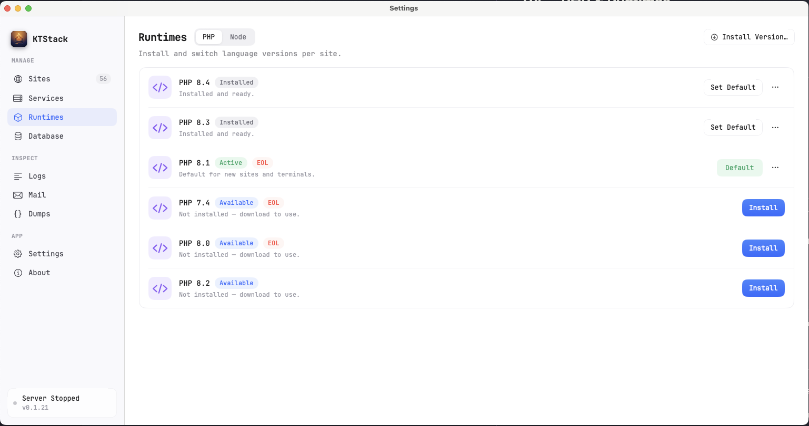
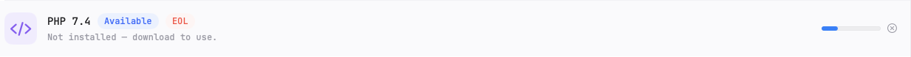
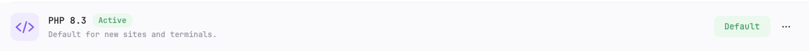
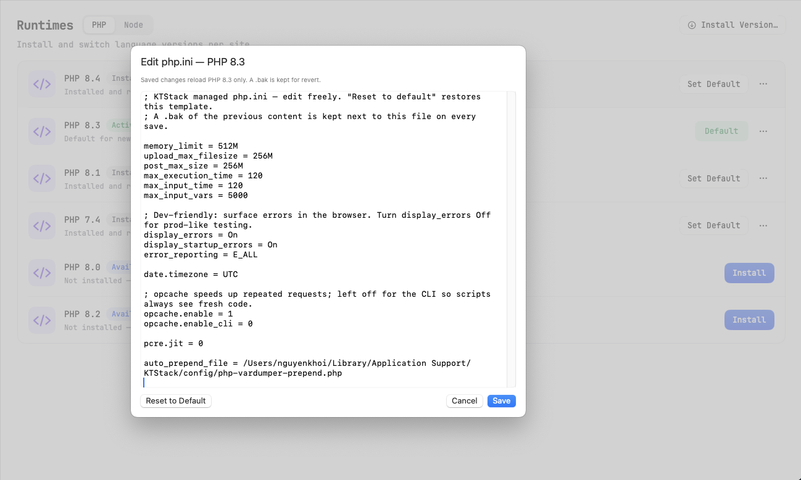
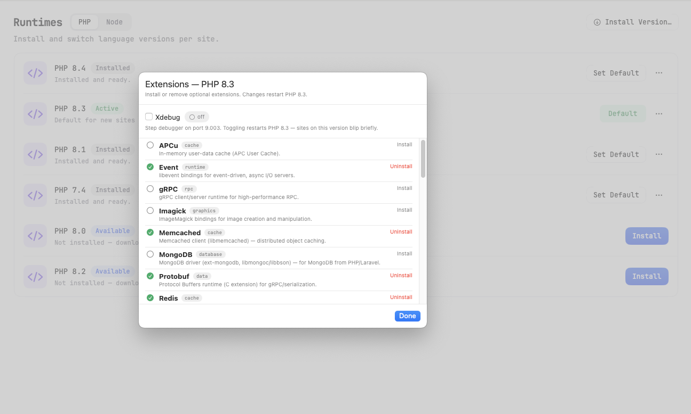

# 04 — PHP & Runtimes

This page covers installing PHP versions, switching between them per site, configuring PHP settings, and managing optional extensions. You can also run Node.js apps at any time.

## What you can do

- Install multiple PHP versions (7.4 through 8.4) and keep them all at once.
- Set a default PHP version that new sites use.
- Change which PHP version a site uses at any time.
- Edit the `php.ini` config file for each version separately.
- Install optional PHP extensions (Redis, Imagick, Xdebug, and many others) on demand.
- Toggle Xdebug on or off for quick debugging.
- Install and switch Node.js versions the same way.

## Opening the Runtimes section

1. Click the KTStack menu-bar icon (lightning bolt in the top-right corner of your menu bar).
2. Click **Runtimes** or press the Runtimes tab in the dashboard.

You'll see two tabs at the top: **PHP** and **Node.js**. Each shows installed versions, available versions to download, and status.

## Installing a PHP version

PHP versions are not included in KTStack. You download them on demand — each takes about 400 MB when extracted.

1. Click the **Install Version…** button at the top of the Runtimes section.
2. A sheet appears showing all available PHP versions (7.4, 8.0, 8.1, 8.2, 8.3, 8.4).
3. Click the **Install** button next to the version you want.
4. KTStack downloads and extracts it. A progress bar shows the download status. The installation takes a minute or two.
5. Once complete, the version appears in the installed list with an **Installed** badge.

You can install multiple versions in parallel. If you cancel a download, click the **X** button next to the progress bar.

### End-of-Life (EOL) versions

PHP versions 7.4, 8.0, and 8.1 are no longer supported by the PHP project. KTStack shows an **EOL** badge next to them in red. You can still use them, but they won't receive security updates. We recommend upgrading to PHP 8.2 or later for new projects.

## Setting a default PHP version

The default version is what new sites use. You can change it anytime.

1. In the Runtimes section, find the PHP version you want as the default.
2. If the version shows an **Installed** badge, click **Set Default**.
3. The version now shows a **Default** badge (green background, white text).
4. New sites created after this will use the new default. Existing sites keep their current PHP version.

You always see which version is the default because it has a green badge.

## Using a different PHP version for a site

Sites store which PHP version they use. You can change it anytime without reinstalling anything.

1. Go to [03 — Managing sites](03-managing-sites.md) and open the site's settings.
2. Find the **PHP Version** field (or **Runtime** field).
3. Choose a different version from the dropdown.
4. Save the change.

KTStack will start using the new version the next time the site handles a request.

### Per-project version selection in the terminal

If your project has a `.ktstack.php-version` file or uses other version markers (like `.php-version`), you can use that version from the terminal too. This is covered in [15 — Shell integration](15-shell-integration.md).

## Editing php.ini

Each PHP version has its own `php.ini` configuration file. You edit it inside KTStack without leaving the app.

1. In the Runtimes section (PHP tab), find the version you want to edit.
2. Click the menu (three dots icon) on the right side of the version row.
3. Click **Edit php.ini…**.
4. A window opens showing the current `php.ini` contents.
5. Make your changes in the text editor.
6. Click **Save** to apply the changes.

### Validation and rollback

KTStack validates your `php.ini` syntax before saving. If there's a syntax error, you'll see a red error message and the file won't save.

- A backup of the old file is kept as `.bak`. If something goes wrong, you can manually restore it.
- When you save, PHP is restarted. Changes take effect immediately.
- If you want to start fresh, click **Reset to Default** to restore the original `php.ini`.

### Common settings

Here are some settings you might change:

| Setting | Purpose | Example |
|---------|---------|---------|
| `memory_limit` | Max memory per request | `memory_limit = 512M` |
| `max_execution_time` | Timeout for long-running scripts (seconds) | `max_execution_time = 300` |
| `upload_max_filesize` | Max file upload size | `upload_max_filesize = 100M` |
| `post_max_size` | Max POST body size | `post_max_size = 100M` |
| `display_errors` | Show errors in browser | `display_errors = 1` |
| `error_log` | Where to write errors | `error_log = /tmp/php-errors.log` |
| `xdebug.mode` | Xdebug mode (debug, profile, etc.) | `xdebug.mode = debug` |

## Managing PHP extensions

Optional PHP extensions like Redis, Imagick, and MongoDB are not loaded by default. You install them on demand, per PHP version.

### Installing an extension

1. In the Runtimes section (PHP tab), find the version you want to extend.
2. Click the menu (three dots icon) on the right.
3. Click **Manage Extensions…**.
4. A window shows two columns: **Available** extensions (left) and **Installed** extensions (right).
5. Find an extension in the **Available** list and click **Install**.
6. KTStack downloads and installs the extension. A progress bar shows the status.
7. Once done, it moves to the **Installed** list.

### Uninstalling an extension

1. Open the extensions manager for the version (same steps as above).
2. Find the extension in the **Installed** list on the right.
3. Click **Uninstall**.
4. The extension is removed immediately. Sites can no longer use it.

### Common optional extensions

| Extension | Type | What it does |
|-----------|------|-------------|
| **Redis** | Cache | Redis client for caching, sessions, and job queues. |
| **Imagick** | Graphics | ImageMagick bindings for image manipulation and creation. |
| **Xdebug** | Debugger | Step debugger, profiler, and stack traces. Toggled separately (see below). |
| **MongoDB** | Database | MongoDB driver for use with Laravel or Mongoose-like libraries. |
| **Memcached** | Cache | Memcached client for distributed object caching. |
| **gRPC** | RPC | gRPC runtime for high-performance RPC services. |
| **Protobuf** | Data | Protocol Buffers runtime for gRPC serialization. |
| **Swoole** | Runtime | Async coroutine runtime for CLI servers (not under PHP-FPM). |
| **SSH2** | Network | libssh2 bindings for SSH connections and SFTP from PHP. |
| **SNMP** | Network | net-snmp bindings for querying SNMP devices. |

Built-in extensions (like OPcache, PDO, mbstring, Intl) are already compiled into every PHP version and don't need to be installed.

## Xdebug quick toggle

Xdebug is special: you can install it and then toggle it on or off without reinstalling. This is useful if Xdebug slows down your site and you only want it active when debugging.

When Xdebug is installed (via the extensions manager above), a toggle appears on the row:

1. Find the PHP version that has Xdebug installed.
2. Look for an **Xdebug** toggle button next to it.
3. Turn it **on** to enable step debugging, or **off** to disable it and improve performance.

The toggle applies only to PHP-FPM (sites running under PHP). CLI scripts (terminal commands) use the php.ini setting regardless of this toggle.

## Installing and managing Node.js

Node.js versions work the same way as PHP versions. You can install multiple Node versions and switch them per site.

1. Click the **Node.js** tab at the top of the Runtimes section.
2. Click **Install Version…** to download a Node release.
3. Once installed, you can:
   - **Set Default** to make new Node sites use it.
   - **Uninstall** to remove it.
   - Switch a site to a different Node version in the site's settings (same as PHP).

KTStack ships with Node 22.22.3 available by default. If you need a different version, let us know, and we'll add it to the catalog.

## Tips and notes

- **Disk space**: Each PHP version is about 400 MB. Install only what you need.
- **Performance**: Installing extensions on demand is slower the first time. Subsequent installations are instant (cached).
- **Conflicts**: If two sites need the same PHP version but different extensions, they share the version but load different extensions.
- **EOL versions**: PHP 7.4, 8.0, and 8.1 are end-of-life. Use them for legacy projects, but plan to upgrade soon.

## Where to go next

Next, read [05 — HTTPS & certificates](05-https-and-certificates.md) to learn how local HTTPS works and how to trust the certificate authority.
