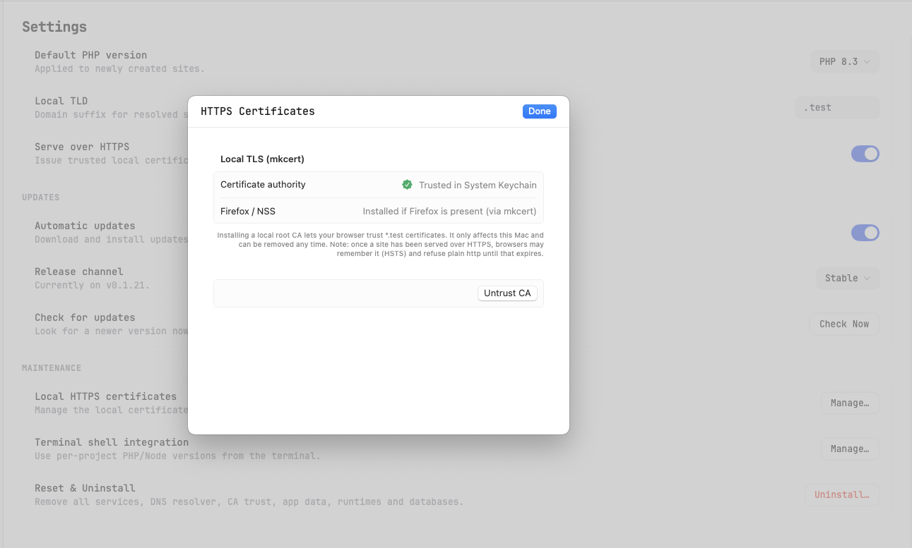

# 05 — HTTPS & Certificates

This page explains how KTStack secures your local sites with HTTPS, how to trust the certificate authority, and what to do if your browser doesn't recognize the certificate.

## How local HTTPS works

When you open a site like `https://myapp.test` in your browser, KTStack:

1. **Generates a local certificate** for that domain using `mkcert`, a tool that creates certificates that are valid and trusted locally on your Mac.
2. **Installs a certificate authority (CA) root** into macOS's System Keychain, so your browser recognizes all KTStack-issued certificates.
3. **Serves the certificate** over HTTPS without any warning (once the CA is trusted).

The CA is created on first use and lives in `~/Library/Application Support/KTStack/ca/`. All certificate data stays on your Mac — nothing is shared with any server.

## Understanding the security model

KTStack's local HTTPS is **not** internet-grade security. It is meant to test features that only work over HTTPS (like service workers, camera access, or secure cookies) in a safe, local environment.

- **The CA is your Mac only**: Certificates signed by it are valid only on your computer.
- **Private keys never leave your machine**: All certificate data is local.
- **Self-signed by design**: The root certificate is self-signed and exists only to make browsers stop warning about your local domains.

This is the same approach used by Valet, Herd, and Laragon.

## Trusting the certificate authority

When you create your first HTTPS site, KTStack asks to install the CA into your System Keychain. You may need to enter your admin password.

### If the CA is not yet trusted

You'll see a banner at the top of the **Services** section saying the local HTTPS CA is not installed or not trusted. You have two options:

1. **Click "Manage" in the banner** to open the certificate settings.
2. **Go to Settings** (gear icon in the dashboard) and find **Local HTTPS Certificates** under the **Maintenance** section.

### Installing and trusting the CA

1. Open the **Local HTTPS Certificates** settings page (see above).
2. You'll see the current state:
   - **Not installed**: No CA exists yet. Click **Install & Trust** to create one and add it to your System Keychain.
   - **Untrusted**: A CA exists, but it's not in the System Keychain. Click **Trust** to add it.
   - **Trusted**: The CA is installed and recognized by your browser. No action needed.

3. If you click **Install & Trust** or **Trust**, macOS may ask for your administrator password. This is normal — the certificate needs to be added to the System Keychain, which is restricted.
4. Wait for the process to complete.

### Uninstalling the CA

If you want to remove the CA from your Keychain (for example, before uninstalling KTStack), you can:

1. Open the **Local HTTPS Certificates** settings page.
2. Click **Untrust** or **Remove** (if available).
3. The CA is removed from your System Keychain. Sites will show certificate warnings in the browser until you re-trust it.

## Enabling or disabling HTTPS for a site

Each site has an **HTTPS** toggle in its settings.

1. Go to [03 — Managing sites](03-managing-sites.md) and open the site's settings.
2. Find the **HTTPS** toggle (usually at the top or in a "Security" section).
3. **Turn on**: The site is served at `https://myapp.test` with a generated certificate.
4. **Turn off**: The site is served at `http://myapp.test` (not secure, no certificate needed).

Toggling HTTPS on and off does not require restarting the site — it takes effect immediately on the next request.

## Browser shows "certificate not trusted" warning

You may still see a browser warning about the certificate if:

1. **The CA is not trusted in your System Keychain yet**. Follow the steps under [Trusting the certificate authority](#trusting-the-certificate-authority) above.
2. **Your browser cached the old untrusted state**. Close and reopen the tab, or clear your browser cache for `*.test` domains.
3. **You're on a different Mac**. Each machine has its own CA. If you move to a different computer, you'll need to trust the CA on that machine too.

### Checking the browser's certificate info

In most browsers, you can click the lock icon in the address bar to see certificate details:

- **Issued to**: The domain (e.g., `myapp.test`).
- **Issued by**: `mkcert development certificate` or similar.
- **Valid from / Valid until**: The certificate is usually valid for 10 years.

If the issuer shows a name you don't recognize (not `mkcert`), the certificate may not be from KTStack.

## Re-issuing certificates

KTStack automatically issues a certificate when you:

- Create a new HTTPS site.
- Add a new domain alias to an HTTPS site.
- Enable HTTPS for a site that had it disabled.

If you want to regenerate the certificate for an existing site (for example, if it was corrupted), you can:

1. Disable HTTPS on the site (toggle off).
2. Wait a few seconds.
3. Enable HTTPS again (toggle on).

A new certificate is generated and the site uses it on the next request.

## Troubleshooting HTTPS issues

| Problem | Solution |
|---------|----------|
| Browser shows "certificate not trusted" | Trust the CA in your System Keychain (see [Trusting the certificate authority](#trusting-the-certificate-authority)). |
| "NET::ERR_CERT_AUTHORITY_INVALID" error | Same as above — the CA needs to be trusted. |
| Certificate expired | KTStack's local certificates are valid for 10 years. If you see an expiration warning, the file may be corrupted. Try disabling and re-enabling HTTPS for the site. |
| "Cannot create certificate" error | The CA root may be missing or corrupted. Go to Settings > Local HTTPS Certificates and reinstall the CA. |
| HTTPS toggle is gray/disabled | HTTPS may be disabled in settings for all sites. Check Settings > Local HTTPS Certificates to enable it globally. |

## FAQ

**Q: Can I use my own certificate instead of KTStack's?**

A: KTStack automatically generates certificates. Custom certificates are not supported at this time.

**Q: Why do I need to trust the CA?**

A: Browsers only recognize certificates signed by a trusted authority. Since KTStack's CA is self-signed, you must explicitly trust it once. After that, all KTStack-issued certificates are automatically recognized.

**Q: Is my local CA secure?**

A: The CA is only usable on your machine. Someone who steals your CA could issue fake certificates for `*.test` domains on their own computer, but not for real domains on the internet. The CA is not suitable for production use.

**Q: Can I back up or export the CA?**

A: The CA is stored in `~/Library/Application Support/KTStack/ca/`. You can back up these files if you want, but KTStack does not provide an export tool.

**Q: What if I uninstall KTStack?**

A: The CA stays in your System Keychain. It's harmless — it only affects `*.test` domains. You can remove it manually through **Keychain Access** on your Mac, or use the Settings page in KTStack to untrust it before uninstalling.

## Where to go next

Next, read [06 — Services](06-services.md) to learn about starting, stopping, and managing background services like MySQL, PostgreSQL, and Mailpit.
