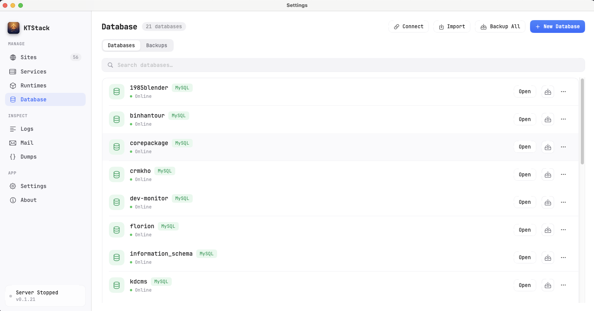
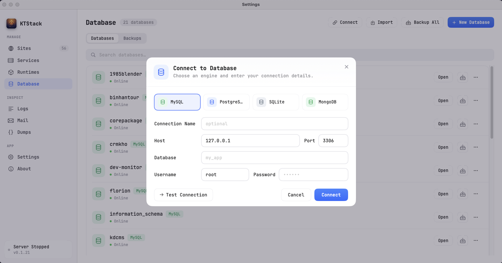
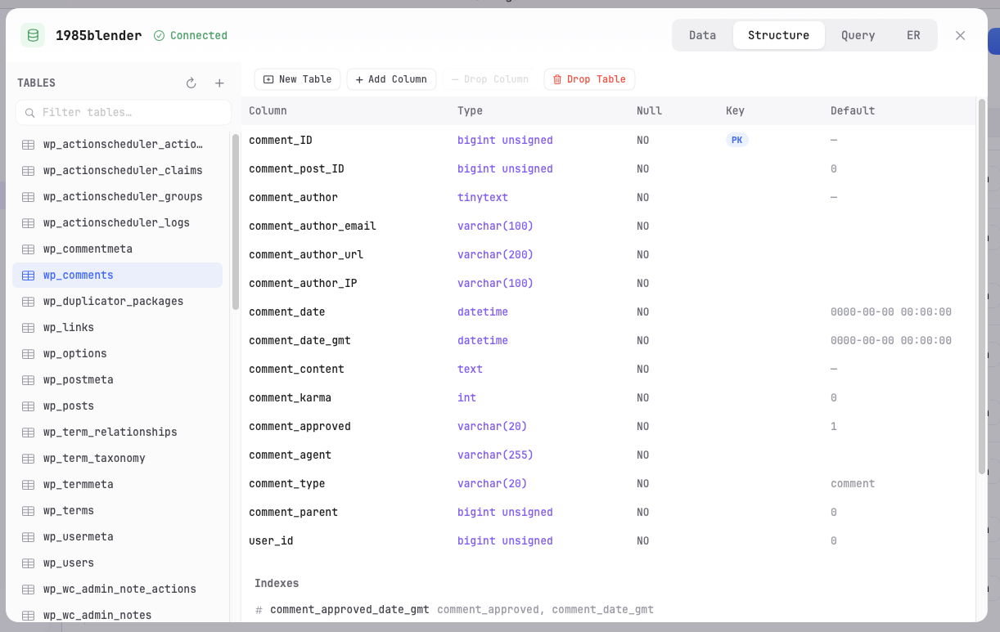
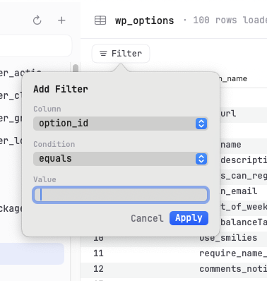

# 07 — Database Basics

This page covers the essentials of connecting to databases in KTStack, creating new databases, and browsing table data. You'll learn how to set up connections, view your schema, and edit records in the grid.

## What are database connections?

KTStack can manage multiple databases at the same time. Each database lives on a **connection** — a named link to a specific database server (MySQL, PostgreSQL, MongoDB, or a SQLite file). You create connections once and reuse them for all your projects.

KTStack comes with bundled MySQL, PostgreSQL, Redis, and MongoDB services — you can connect to these right away if you start them. You can also add connections to remote servers or SQLite files on your Mac.

## Opening the Database section

1. Click the KTStack menu-bar icon.
2. Click **Database** or press the Database tab in the dashboard.
3. You'll see two tabs at the top: **Databases** and **Backups**.

The Databases tab shows your list of databases and a sidebar for connections. The Backups tab manages snapshots (covered in [09 — Database backup & restore](09-database-backup-and-restore.md)).

## Adding a connection

Before you can see any databases, you must add a connection.

### Connect to a local service

If you have MySQL or PostgreSQL running on your Mac via KTStack:

1. In the Database section, click the **Connect** button (or click **+** in the Connection sidebar).
2. A modal "Add Connection" appears.
3. Select the **Engine** (MySQL, PostgreSQL, MongoDB, or SQLite).
4. For a **local MySQL server**, the form pre-fills:
   - **Host**: `127.0.0.1`
   - **Port**: `3306`
   - **User**: `root` (or your custom user)
   - **Password**: (leave blank if no password is set)
5. Click **Test Connection** to verify it works. You'll see "✓ Connection successful" if it's good.
6. Click **Add** to save the connection.

The connection is now available in the sidebar. You can add as many as you need.

### Connect to a remote database

To connect to a database on another server:

1. Click **Connect** and choose the engine (MySQL, PostgreSQL, MongoDB).
2. Fill in the connection details:
   - **Name**: A friendly label (e.g., "Production MySQL" or "AWS Postgres").
   - **Host**: The server's hostname or IP (e.g., `db.example.com` or `192.168.1.5`).
   - **Port**: The database port (usually `3306` for MySQL, `5432` for PostgreSQL, `27017` for MongoDB).
   - **User**: Your database username.
   - **Password**: Your database password (stored securely in macOS Keychain).
   - **Database**: (optional) The default database to open. Leave blank to see all databases.
3. If using TLS/SSL (for remote connections), choose **TLS Mode** from the dropdown.
4. Click **Test Connection** to verify.
5. Click **Add** to save.

### Connect to a SQLite file

For SQLite databases (single-file databases):

1. Click **Connect** and choose **SQLite**.
2. Enter a **Name** (e.g., "My App DB").
3. Click **Choose** to select the `.sqlite` or `.db` file on your Mac.
4. Optionally, toggle **Read-only** if you want to browse without editing.
5. Click **Test Connection**.
6. Click **Add**.

### Edit an existing connection

To change a connection's details (e.g., password, host):

1. Find the connection in the left sidebar.
2. Right-click (or click the menu icon if visible).
3. Select **Edit Connection**.
4. Update the fields and click **Save**.

### Delete a connection

1. Find the connection in the sidebar.
2. Right-click and select **Delete Connection**.
3. Confirm the deletion.

The connection is removed from KTStack, but the actual database server and data are untouched.

## Viewing your databases

Once you've added a connection and it shows as connected:

1. The **Databases** tab lists all databases on that server.
2. Each database shows:
   - Its **name**
   - The **number of tables**
   - A **size** (if available)
3. Click **Search** and type to filter the list by database name.

## Creating a new database

To create a new database:

1. Make sure you have a **MySQL or PostgreSQL connection selected** (the button is enabled).
2. Click the **New Database** button in the header.
3. A dialog appears asking for the database **name**.
4. Enter a name (lowercase, no spaces, e.g., `my_app_db`).
5. Click **Create**.
6. The database appears in the list immediately.

**Note**: Creating a database requires write access. If your connection is read-only, this button is disabled.

## Opening a database

To browse tables and data inside a database:

1. In the Databases tab, double-click a database name or click it once and press Enter.
2. The database **schema tree** appears on the left sidebar.
3. The main area shows an empty grid (ready for you to select a table).

Alternatively, click a database card and look for an **Open** button.

## Exploring the schema tree

Once a database is open, the left sidebar shows its **schema**:

- **Tables** — expandable list of all tables in the database.
- **Views** — if the database has views, they're listed separately.
- **Columns** — click the arrow next to a table to see its columns.

Each column shows:
- Its **name**
- A **type** icon (e.g., `INT`, `VARCHAR`, `TIMESTAMP`)
- A **key icon** if it's a primary key

### View a table's SQL definition

To see the `CREATE TABLE` statement:

1. Right-click a table name in the schema tree.
2. Select **View DDL** (or similar).
3. A modal appears with the full SQL create statement.
4. You can copy this SQL if needed.

## Browsing table data

Once you've selected a table, the main grid shows all rows and columns:

1. Each **row** is a record in the table.
2. Each **column** shows a field's values.
3. **Cells** show the data. `NULL` values appear faded.
4. Click on a column header to **sort** by that column (ascending or descending).
5. Scroll right to see more columns.
6. Scroll down to load more rows (pagination is automatic).

### Search and filter rows

To find specific records:

1. Click the **Filter** button (usually a funnel icon) above the grid.
2. A popover appears with filter options:
   - **Column**: Choose which column to filter by.
   - **Condition**: Choose an operator:
     - `equals`, `not equals`
     - `contains` (for text fields)
     - `greater than`, `less than` (for numbers/dates)
     - `is null`, `is not null`
   - **Value**: Enter what you're looking for (e.g., `admin` or `25`).
3. Click **Apply**.
4. The grid updates to show only matching rows.
5. To add another filter, click **Add Filter** again. Multiple filters stack (AND logic).
6. To remove a filter, click the **X** next to it.

### Edit a cell

To change a single value:

1. **Double-click a cell** in the grid.
2. The cell becomes editable (background turns light yellow).
3. Type the new value (or press **Delete** to clear it).
4. Press **Tab** or **Enter** to save.
5. Press **Escape** to cancel.

If a cell shows `NULL`, you can click it to set a value, or double-click a filled cell to change it.

### Edit an entire row

To edit multiple columns at once or insert a new row:

1. **Click the row** to select it.
2. Right-click and select **Edit Row** or press **⌘E**.
3. A modal appears with all columns for that row.
4. Edit the fields:
   - For **nullable columns**, you can check the **NULL** checkbox to set the value to `NULL`.
   - For **primary keys**, the field is read-only (you can't change a row's ID after creation).
5. Click **Save**.

### Insert a new row

To add a new record:

1. Right-click the grid or click the **Insert** button.
2. A "Add Row" modal appears.
3. Fill in the columns:
   - Fields with **default values** can be left empty (the default is used).
   - **Nullable columns** can be left empty or set to `NULL`.
   - Non-nullable fields must have a value.
4. Click **Save**.

The new row is added to the table immediately.

## Understanding data safety

KTStack protects you from accidental data loss:

- **Parameterized queries**: When you edit a cell, the value is sent as a parameter, not interpolated into SQL. This prevents injection bugs.
- **One-row guard**: When you edit a row, KTStack ensures exactly one row is affected. If something goes wrong, the edit is rolled back.
- **No keyless deletes**: You can't delete rows without a WHERE condition that targets specific rows. Bulk deletes require you to be explicit.
- **Transactions**: Every write is wrapped in a transaction. Either all changes succeed or none do.

These guards are transparent to you — they just prevent mistakes.

## Common tasks

### Find a table by name

1. In the schema tree, there's usually a **search box** at the top.
2. Type the table name or part of it.
3. The tree filters to show matching tables.

### Copy a cell value

1. Click the cell.
2. Press **⌘C** (or right-click and select **Copy**).
3. Paste it elsewhere.

### Export a table to CSV

1. Right-click a table in the schema tree.
2. Select **Export as CSV**.
3. A save dialog appears; choose where to save the file.

The table is exported as a CSV file with headers.

### Sort by multiple columns

1. Click a column header to sort by that column (ascending or descending).
2. Click again to reverse the sort direction.
3. For multi-column sorts, hold **Shift** and click a second column header (if the UI supports it; otherwise, sort by one column at a time).

## Tips and notes

- **Connection credentials**: Passwords are stored in your macOS Keychain, not in a plain text file. If you change your database password, edit the connection to update it.
- **Read-only mode**: If you connect to a remote database and mark the connection as read-only, you won't be able to edit or delete data. Use this for production databases.
- **Large tables**: If a table has millions of rows, scrolling and filtering may be slow. KTStack uses pagination to load rows on demand.
- **Time zones**: Dates and times are displayed as stored. If your database uses UTC and your Mac is in a different zone, the timestamps won't adjust automatically.

## Troubleshooting

| Problem | Solution |
|---------|----------|
| "Connection failed" | Check the hostname, port, username, and password. Make sure the database service is running (look in Services section). |
| "Access denied" | The password is wrong or the user doesn't have permission. Double-check credentials and try the database client directly (e.g., `mysql` CLI). |
| "Connection refused" | The database is not listening on that port. Check if the service is installed and running. |
| Can't see any databases | You may be connected but have no databases yet. Create one using the **New Database** button. |
| "Read-only connection" error | Your connection is marked as read-only. Edit the connection to disable read-only mode if you have the password. |
| Schema tree is empty | Click on a database name to load its schema. Some databases may take a moment to load. |

## Where to go next

Now that you can browse databases, head to [08 — Database query & ER diagram](08-database-query-and-er-diagram.md) to learn how to write SQL queries and visualize table relationships. Or skip to [09 — Database backup & restore](09-database-backup-and-restore.md) if you want to back up your data.
