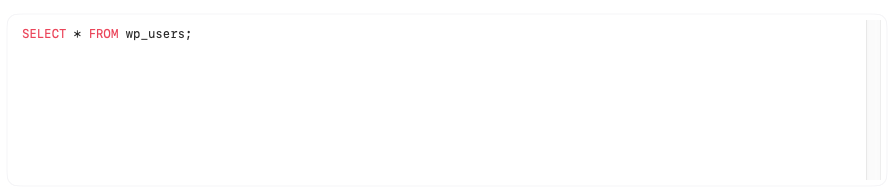
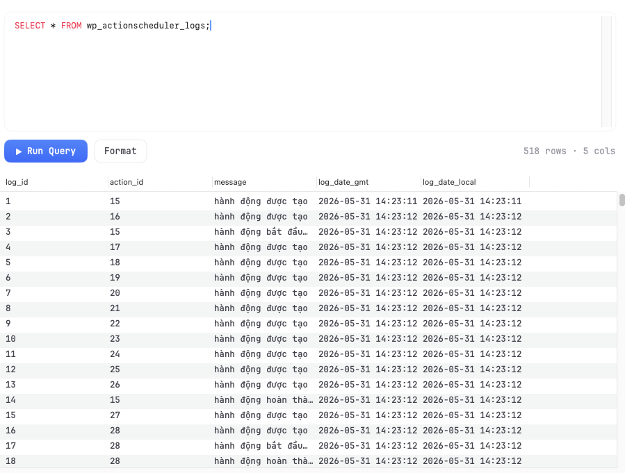
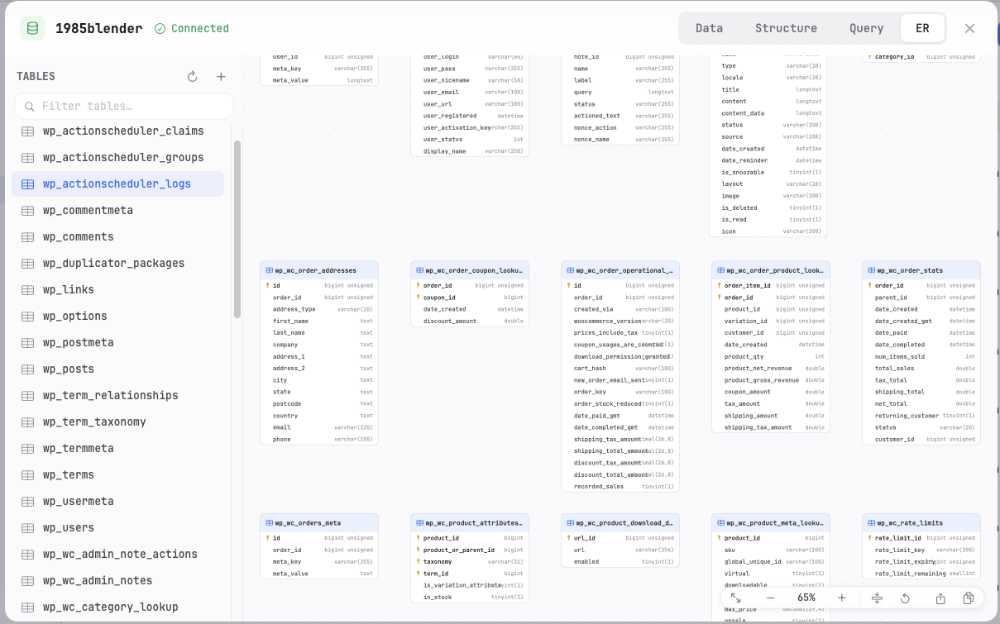

# 08 — Database Query & ER Diagram

This page covers writing SQL queries in KTStack's code editor, running them, viewing results, and visualizing your database schema with the ER (entity-relationship) diagram.

## Opening the Query editor

Once you have a database open (see [07 — Database basics](07-database-basics.md)):

1. The **Database** section has a tab area below the schema tree.
2. By default, you see a **Grid** tab (showing table data).
3. Click the **Query** tab to open the SQL editor.
4. A blank SQL editor appears with a large text field and an **Execute** button.

## Writing and executing queries

The SQL editor is where you write custom queries to explore and manage your data.

### Basic query structure

1. Click in the editor and start typing SQL:
   ```sql
   SELECT * FROM users WHERE role = 'admin'
   ```
2. The editor has **syntax highlighting** for SQL keywords (SELECT, FROM, WHERE, etc.).
3. Press **Execute** (or **⌘Enter**) to run the query.
4. Results appear below the editor in a grid.



### Running safe queries

KTStack protects you when you write DML queries (INSERT, UPDATE, DELETE):

- **Parameterized values**: If your query uses parameters, they are sent separately from the SQL, preventing injection.
- **No keyless deletes**: You cannot run an `UPDATE` or `DELETE` without a `WHERE` clause that KTStack can verify. Queries like `DELETE FROM users` are rejected with an error message.
- **One-row guard**: When you update or delete, KTStack checks that exactly one row is affected. If the query affects zero rows or more than one, the transaction is rolled back and you see an error.
- **Transactional safety**: Every query is wrapped in a transaction. Either the whole thing succeeds or it rolls back.

These guards mean you can experiment safely — you won't accidentally wipe a table.

### SQL auto-completion

As you type, KTStack suggests completions:

- **Table names** from your current database.
- **Column names** from tables you've mentioned.
- **SQL keywords** like SELECT, WHERE, JOIN.

Press **Escape** to dismiss suggestions or use **arrow keys** to navigate and **Enter** to accept.

### Query history

To reuse a query you ran before:

1. Click the **History** button (clock icon, if visible) in the editor toolbar.
2. A dropdown lists your recent queries.
3. Click one to load it back into the editor.
4. Edit if needed and execute again.

This is useful for queries you run frequently.

### Multiple query tabs

To work on several queries at once:

1. Click the **+** icon next to the Query tab to create a new query tab.
2. Each tab has its own editor and results.
3. Click a tab to switch between them.
4. Tabs are not saved automatically — if you close KTStack, they're lost. Copy queries you want to keep.

## Reading query results

After you run a query, the results appear in a grid below the editor:

| Part | Description |
|------|-------------|
| **Column headers** | The names of columns returned by your query. Click a header to sort. |
| **Rows** | Each row is a result record. Scroll to see more. |
| **Cell values** | Individual data. `NULL` values appear faded. |
| **Row count** | Shows how many rows were returned (e.g., "42 rows"). |



### Interacting with results

- **Click a column header** to sort by that column (ascending or descending). Click again to reverse.
- **Scroll right** to see more columns.
- **Scroll down** to load more rows (pagination).
- **Right-click a row** to see options (copy, export, etc.).
- **Copy a cell** — click it, press **⌘C**, and paste elsewhere.

### Export results

To save query results:

1. After running a query, look for an **Export** or **Download** button.
2. Choose a format:
   - **CSV** — comma-separated values, opens in Excel or a text editor.
   - **JSON** — structured data format.
3. Choose where to save the file.

## Understanding the ER Diagram

The **ER Diagram** (Entity-Relationship Diagram) is a visual map of your database schema. It shows tables, columns, and how they relate to each other.

### Opening the ER diagram

1. In the Database section, look for an **ER Diagram** or **Schema** tab (usually near Query and Grid).
2. Click it.
3. The diagram loads and shows:
   - **Boxes** for each table, with column names and types.
   - **Lines** connecting tables where there are foreign key relationships.
   - **Primary keys** marked with a key icon.

If the database has no tables, you see an empty state.



### Reading the diagram

Each table box shows:

| Element | Meaning |
|---------|---------|
| **Table name** | The table's name at the top. |
| **Columns** | Rows inside the box, each showing a column. |
| **PK indicator** | A key icon next to primary key columns. |
| **Type label** | The data type (INT, VARCHAR, TIMESTAMP, etc.). |
| **Lines** | Connections between tables indicate foreign keys. An arrow points from the foreign key to the referenced table. |

### Navigating the diagram

- **Zoom in/out**: Scroll the mouse wheel or pinch on a trackpad to zoom.
- **Pan**: Click and drag the canvas to move around.
- **Click a table**: Highlight a table to focus on it.

The diagram updates automatically if you add or drop tables.

## Common query tasks

### Count records in a table

```sql
SELECT COUNT(*) as total FROM users
```

Press Execute. Result shows one row with `total = [number]`.

### Find records matching a condition

```sql
SELECT * FROM orders WHERE status = 'shipped'
```

Results show all orders with status "shipped".

### Join data from two tables

```sql
SELECT users.name, orders.order_date
FROM users
JOIN orders ON users.id = orders.user_id
```

Results combine data from both tables where the IDs match.

### Insert a new record

```sql
INSERT INTO users (name, email) VALUES ('Alice', 'alice@example.com')
```

Press Execute. You see "1 row affected" if successful.

### Update existing records

```sql
UPDATE products SET price = 99 WHERE id = 5
```

Results show "1 row affected" (because of the WHERE clause and one-row guard).

### Delete a record

```sql
DELETE FROM comments WHERE id = 123
```

Results show "1 row affected".

## Tips and notes

- **Syntax highlighting**: Keywords appear blue, strings appear green, comments appear gray.
- **Error messages**: If you have a syntax error or a problem with your query, you'll see an error below the Execute button. Read it carefully — it often tells you exactly what's wrong.
- **Large result sets**: If a query returns 10,000+ rows, loading may take a moment. Use a LIMIT clause to fetch fewer rows: `SELECT * FROM logs LIMIT 100`.
- **Transactions**: You can manually start a transaction with `BEGIN` and commit with `COMMIT`. This is advanced — most queries are auto-committed.
- **Database-specific SQL**: Different databases have different SQL dialects. MySQL, PostgreSQL, and SQLite each have quirks. If something doesn't work, check the docs for your database engine.

## Understanding the safety features

### Why the one-row guard?

When you run `UPDATE users SET role = 'admin' WHERE id = 5`, KTStack verifies that exactly one row is affected. If zero rows match the WHERE clause (e.g., the ID doesn't exist), the update is rolled back and you see an error. This prevents silent failures.

### Why no keyless deletes?

A query like `DELETE FROM users` (with no WHERE clause) would delete everything. KTStack refuses to run it. You must specify exactly which rows to delete:

```sql
DELETE FROM users WHERE id = 999
```

If you really need to delete all rows, you can use:

```sql
DELETE FROM users WHERE id IS NOT NULL
```

This makes it explicit that you're deleting all records.

### Parameterized queries

When you send data to the database, KTStack separates the SQL structure from the values. For example:

```sql
SELECT * FROM users WHERE email = 'user@example.com'
```

The string `user@example.com` is sent as a parameter, not concatenated into the SQL. This prevents SQL injection even if the value contains special characters like quotes.

## Troubleshooting

| Problem | Solution |
|---------|----------|
| "Syntax error" | Check your SQL for typos. Make sure table and column names are spelled correctly and quoted if needed. |
| "Table not found" | You may be querying the wrong database. Check that you've opened the correct database and table names are case-sensitive on some databases. |
| "No results" | Your WHERE clause may be too restrictive. Try removing the condition: `SELECT * FROM table_name LIMIT 10`. |
| "Query timed out" | The query is taking too long (e.g., on a very large table). Add a LIMIT clause or use an index on the WHERE column. |
| "Permission denied" | Your database user doesn't have permission to run that operation. Check your connection credentials. |
| ER diagram shows no tables | Either the database is empty or the diagram is still loading. Wait a moment and try refreshing. |

## Where to go next

Now you can write queries and explore your schema visually. Next, head to [09 — Database backup & restore](09-database-backup-and-restore.md) to learn how to back up your databases and restore from backups. Or move to [10 — Email testing with Mailpit](10-email-testing-mailpit.md) if you want to test outgoing email.
