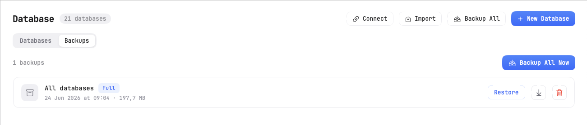
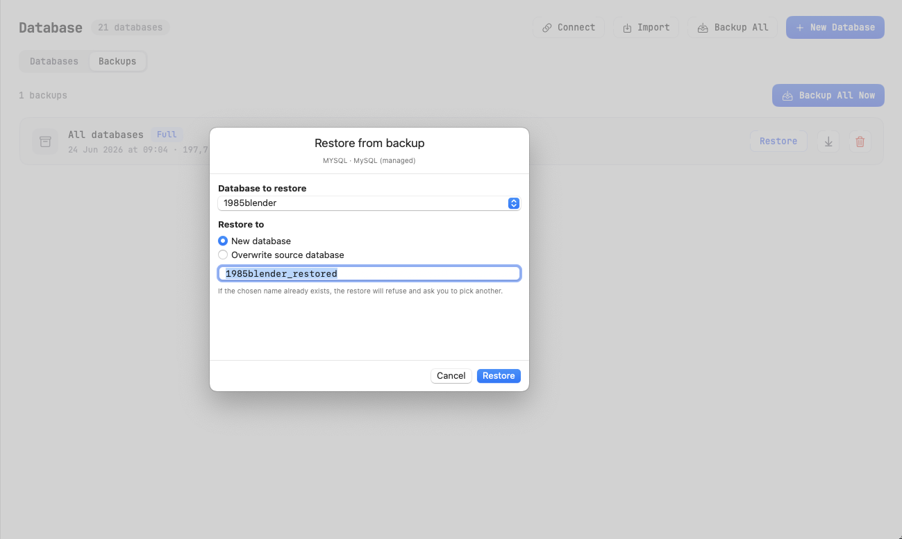
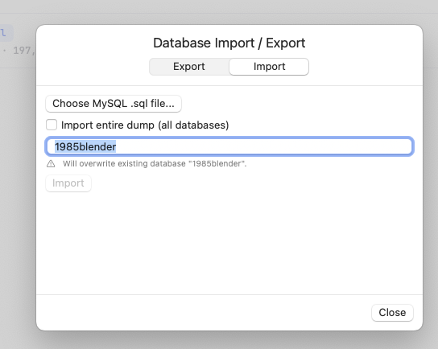

# 09 — Database Backup & Restore

This page covers creating backups of your databases, restoring from backups, and importing/exporting individual databases or tables.

## What is a backup?

A **backup** is a snapshot of your databases at a point in time. KTStack can:

- **Snapshot one database** or all databases at once.
- **Restore** a snapshot back into your database server (with options to overwrite or create a new database).
- **Export a backup** to a file so you can move it elsewhere or store it securely.
- **Import** SQL dumps or CSV files to load data back in.

Backups are stored in `~/Library/Application Support/KTStack/backups/` on your Mac.

## Opening the Backup section

1. Click the KTStack menu-bar icon.
2. Click **Database** in the dashboard.
3. Click the **Backups** tab at the top.

You'll see:
- A list of backup sets you've created.
- Buttons to **Backup Current Database** or **Backup All Databases**.
- Per-backup actions like restore, delete, and export.

## Creating a backup

### Backup the current database

To save a snapshot of the database you're currently viewing:

1. Open a database (see [07 — Database basics](07-database-basics.md)).
2. In the Backups tab, click **Backup Current Database**.
3. A progress indicator appears: "Backing up [database name]…"
4. When done, you see "Backed up [database name]." and a new backup set appears in the list.

The backup takes a few seconds depending on the database size.

### Backup all databases at once

To save all databases on a connection:

1. In the Backups tab, click **Backup All Databases**.
2. KTStack lists all user databases (excluding system schemas) and begins the backup.
3. A progress message shows: "Backing up N databases…"
4. When complete, you see a single backup set containing all databases.

This is useful before testing major changes or deploying code.

## Viewing backup sets

Each backup set shows:

| Column | Meaning |
|--------|---------|
| **Name** | The connection name and databases included. |
| **Created** | The date and time the backup was created. |
| **Size** | The disk space used (e.g., 2.5 MB). |
| **Databases** | A list of database names in the backup. |

Click a backup set to expand it and see details.

## Restoring from a backup

### Restore a single database

To restore one database from a backup set:

1. Find the backup set in the list.
2. Click **Restore** (or right-click and select **Restore**).
3. A modal appears asking:
   - **Which database to restore**: Choose from the list of databases in the backup.
   - **Restore target**: Choose one of:
     - **Overwrite** — replace the existing database with the backup. Any changes since the backup are lost.
     - **Create new** — restore into a new database with a different name (e.g., `my_db_restored`). The original stays unchanged.
4. Click **Restore**.
5. A progress message shows: "Restoring [database]…"
6. When done, you see "Restored [database]." and the database list updates.

### Restore all databases from a backup

To restore an entire backup set at once:

1. Find the backup set.
2. Click **Restore All** (or right-click and select **Restore All**).
3. A confirmation appears: "This will overwrite all N databases in [connection] with their backup versions. Data added after this backup was created will be lost."
4. Click **Restore All Databases** to confirm.
5. KTStack restores each database one by one. A progress message shows: "Restoring [database] (N/M)…"
6. When complete, all databases are restored.

**Warning**: Restoring overwrites your current data. Make sure you have another backup if you need to keep the current version.

## Managing backups

### View backup details

Click a backup set to expand it and see:
- Creation date and time
- Total size
- Names and sizes of each database in the set

### Export a backup

To save a backup to a file so you can upload it elsewhere or store it safely:

1. Find the backup set.
2. Click **Export** (or right-click and select **Export**).
3. A file dialog appears.
4. Choose where to save the file (your Desktop, a cloud folder, an external drive, etc.).
5. Click **Save**.
6. A progress message shows: "Exporting backup…"
7. When done, the file is saved. You can move or upload it as needed.

Exported backups are compressed and can be imported back later.

### Delete a backup

To remove a backup set and free up disk space:

1. Find the backup set.
2. Right-click and select **Delete** or click the delete icon.
3. A confirmation appears: "Permanently delete this backup? This cannot be undone."
4. Click **Delete** to confirm.
5. The backup is removed from disk immediately.

## Importing and exporting individual databases

Beyond full backups, you can import and export individual databases or tables for more flexibility.

### Import a SQL dump

To load a SQL file (a text file with CREATE TABLE and INSERT statements):

1. In the Database section, click the **Import** button (usually in the header).
2. An "Import/Export" modal appears.
3. Click **Import SQL File**.
4. A file dialog opens.
5. Select a `.sql` file from your Mac.
6. Click **Open**.
7. A dialog asks for the **target database**:
   - **Create a new database** — give it a new name.
   - **Import into an existing database** — choose one from the list.
8. Click **Import**.
9. A progress message shows: "Importing [file name]…"
10. When done, you see "Imported all databases from [file]." and the new tables appear.

This is useful for loading backups made by other tools or database exports from colleagues.

### Import a CSV file

To load data from a CSV (comma-separated values) file into a table:

1. First, create a table with the right columns (use [08 — Database query & ER diagram](08-database-query-and-er-diagram.md) to write a CREATE TABLE query).
2. In the Database section, click **Import**.
3. Select **Import CSV**.
4. Choose your `.csv` file.
5. A mapping dialog appears showing:
   - CSV column names
   - Target table columns
6. Align them if they don't match automatically.
7. Click **Import**.
8. The rows from the CSV are inserted into the table.

### Export a table as SQL

To save a table definition and all its data as SQL:

1. In the schema tree, right-click a table.
2. Select **Export as SQL**.
3. A file dialog appears.
4. Choose where to save the `.sql` file.
5. Click **Save**.
6. The file contains CREATE TABLE and all INSERT statements needed to recreate the table elsewhere.

### Export a table as CSV

To save a table's data as a CSV file (useful for Excel or other tools):

1. In the schema tree, right-click a table.
2. Select **Export as CSV**.
3. A file dialog appears.
4. Choose the save location.
5. Click **Save**.
6. The CSV file contains headers and all rows, ready to open in Excel or a text editor.

## Backup strategies

### Daily backups

If you're actively developing, create a backup at the start of each day or before making major changes. This is especially important if you're testing migrations or refactoring data.

### Before deployments

Always back up production-like databases before deploying code. If something goes wrong, you can roll back your data.

### Weekly full snapshots

Keep weekly full backups of all databases. Store exports on cloud storage (Google Drive, Dropbox) or an external drive.

### Before resetting a service

If you plan to reset a service (see [06 — Services](06-services.md)), back up its data first. Resetting destroys everything.

## Storage and locations

- **KTStack backups**: `~/Library/Application Support/KTStack/backups/`
- **Exported backups**: Wherever you choose (Desktop, Downloads, cloud storage, etc.)
- **Size considerations**: Each backup is compressed but can be large. A 100 MB database produces a backup of similar size. Monitor your available disk space.

## Tips and notes

- **Backup naming**: KTStack names backups with a timestamp. You can't rename them in the app, but you can rename exported files.
- **Backup frequency**: Backups are quick for small databases (<100 MB) but can take longer for large ones. Plan accordingly.
- **Incremental backups**: KTStack creates full snapshots, not incremental ones. Each backup is a complete copy.
- **Automated backups**: KTStack doesn't auto-backup. You create them manually or on a schedule outside the app.
- **Network backups**: You can export a backup and upload it to cloud storage for off-site protection.

## Troubleshooting

| Problem | Solution |
|---------|----------|
| "Backup failed" | Check that the database is running and connected. Look at the error message for details. |
| "Restore failed" | Make sure the target database doesn't have locks or active connections. Stop any tools using it and try again. |
| "Import failed" | Check that your SQL or CSV file is formatted correctly. For SQL, make sure the table names match the target database. |
| "Not enough disk space" | Your Mac is running low on free space. Delete old backups or move them to an external drive. |
| Can't find the backup file after export | Check your Downloads folder or the folder you selected in the save dialog. Backups are stored wherever you chose to save them. |
| Backup is very large | If your database has huge tables or many binary data, backups can be big. Consider exporting just the data you need or compressing the backup file further. |

## Where to go next

Now you can protect your data with backups. Next, head to [10 — Email testing with Mailpit](10-email-testing-mailpit.md) to learn how to test outgoing emails from your local sites. Or jump to [11 — Logs & dumps](11-logs-and-dumps.md) to debug your applications.
