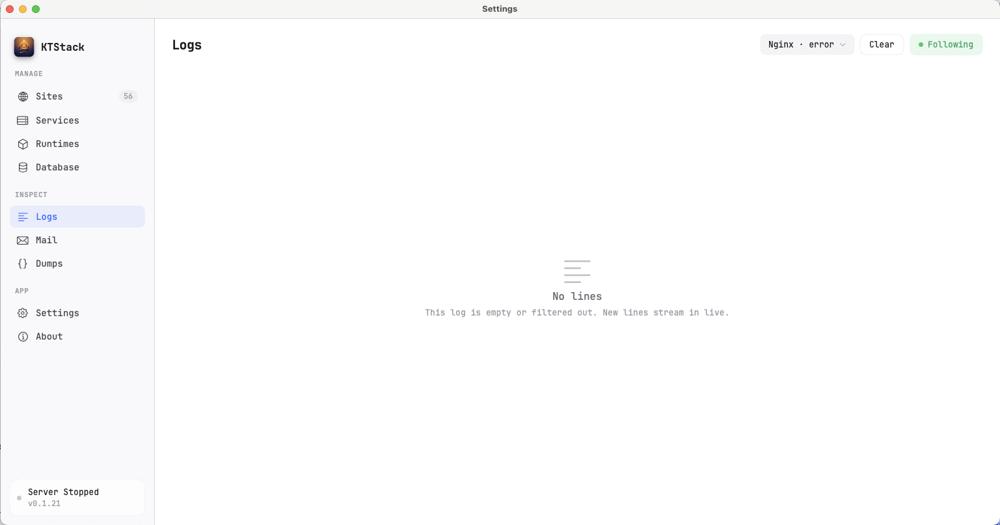
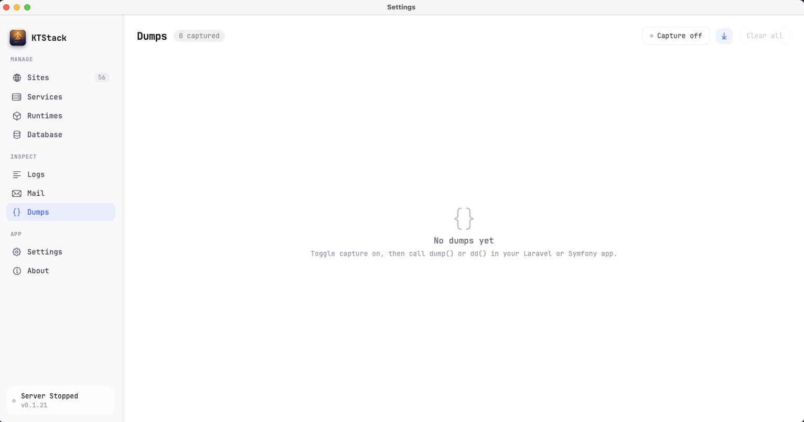

# 11 — Logs and Dumps

This page covers two powerful debugging tools built into KTStack: live log viewing from any site or service, and capturing `dump()` / `dd()` output from your PHP applications.

## Logs

The Logs section lets you tail real-time output from any site or background service. You can filter by source, pause, scroll back in history, and search for errors.

### Opening the Logs section

1. Click the KTStack menu-bar icon and open the dashboard.
2. Click the **Logs** tab or press the Logs button in the sidebar.

You'll see a list of available log sources on the left, and the live output on the right.

### What log sources are available?

KTStack groups logs into two categories:

**Service logs** — background services that power your environment:
- **Nginx · error** — web server errors and warnings
- **Nginx · access** — all HTTP requests to your sites (method, URL, response code)
- **PHP-FPM** (per version) — PHP runtime errors and warnings
- **MySQL**, **PostgreSQL**, **Redis**, **MongoDB**, **Mailpit** (if installed) — database and email service logs

**Site logs** — per-project output:
- **[site-name] · access** — requests to a specific site
- **[site-name] · error** — errors from a specific site's PHP or Node process

### Selecting a log source

1. Click the **log source picker** (top-left, the icon with horizontal lines and the current selection).
2. A dropdown appears showing all available sources, grouped by type.
3. Type to search for a source (e.g., "nginx" to find Nginx logs, or "myapp" to find logs for a site named "myapp").
4. Click a source to select it. The log viewer switches to that source.

### Reading live logs

As soon as you select a source, KTStack begins tailing the log in real time. Each line shows:
- A **timestamp** (HH:MM:SS format)
- A **severity level** for service logs: **INFO** (gray), **WARN** (yellow), **ERROR** (red)
- The **log message**

Service logs and access logs are color-coded by severity. Error messages stand out in red.

### Controlling the log tail

At the bottom of the Logs section, you'll see controls:

| Control | Purpose |
|---------|---------|
| **Follow** (down arrow icon) | When on, new logs automatically scroll into view. When off, you can scroll back to see history. Click to toggle. |
| **Auto-scroll** (or label) | A toggle to control whether new lines push the view down automatically. |
| **Pause** (play/pause icon, optional) | Stops tailing and freezes the display. Click to resume. |
| **Clear** (trash icon) | Clears the current log view. Note: this does not delete the actual log file, just the on-screen display. |

### Typical debugging workflow

1. **Find the error**: Open the appropriate log source (e.g., "nginx · error" for web server issues, or your site's error log).
2. **Scroll to the time**: Look for timestamps near when the issue occurred. The most recent entries are at the bottom.
3. **Read the message**: service logs often include a one-line summary. Access logs show the HTTP request (method, path, response code).
4. **Take action**: Use the info in the log to fix your code or configuration.

### Tips and notes

- **Nginx access logs show** Method (GET, POST, etc.), URL path, response code (200 = ok, 4xx = client error, 5xx = server error), and response time.
- **PHP error logs show** Line number, function name, error type (Deprecated, Warning, Fatal Error, etc.), and the error message.
- **Multiple sites**: If you have many sites, search the picker by site name instead of scrolling.
- **Empty logs**: If a source is listed but empty, it may not have generated output yet. Check if the service is running and traffic is hitting it.

## Dumps

The Dumps section captures `dump()` and `dd()` output from your PHP applications (Laravel, Symfony, etc.) and displays them in an organized list. You can expand dumps, copy their content, and clear the list.

### What are dumps?

In modern PHP frameworks like Laravel and Symfony:
- `dump($variable)` outputs the variable and continues execution
- `dd($variable)` outputs the variable and dies (stops execution)

Normally, these print to the browser or terminal, which can be messy. KTStack's dump collector intercepts them and displays them in a clean list instead.

### Opening the Dumps section

1. Click the KTStack menu-bar icon and open the dashboard.
2. Click the **Dumps** tab or look for a Dumps button in the sidebar.

You'll see a header with controls, and below it a list of captured dumps (or an empty state if capturing is off or nothing has been dumped yet).

### Enabling capture

At the top of the Dumps section, you'll see a **Capturing** toggle. By default, it is off.

1. Click the toggle to enable dump capturing.
2. The status changes to **Capturing** (with a green dot), and the app begins listening for `dump()` calls from your PHP app.
3. Go to your PHP code and trigger a `dump()` call (e.g., by accessing a page or running a command that calls `dump($something)`).
4. The dump appears in the list below, with a timestamp.

### Understanding dump capture

When you enable capturing, KTStack injects a special dump handler into every PHP request on every site. When your code calls `dump()` or `dd()`, the handler intercepts it and sends the output to KTStack instead of the browser.

If dump capturing is off, calls to `dump()` go to the browser as normal (and may look messy).

### Reading a captured dump

Each dump in the list shows:
- A **timestamp** (HH:MM:SS.mmm format) when the dump was captured
- A **preview** of the variable (first 100 characters or so)
- An **expand/collapse icon** (▶ or ▼)

Click on a dump to expand it and see the full variable structure.

### Expanded dump view

When expanded, a dump shows:
- The **full structure** of the variable (nested arrays, objects, properties)
- **Type information** (string, int, array, object, etc.) for each item
- **Copy button** to copy the dump content to your clipboard
- **Auto-scroll** option to keep this dump visible if more dumps come in

### Clearing dumps

At the top right of the Dumps section, click **Clear all** to remove all captured dumps. The list becomes empty, but capturing remains on. You can start a new session of dumps immediately.

### Tips and notes

- **Capturing has a limit**: KTStack stores up to 100 recent dumps in memory. Older ones are discarded.
- **Affects performance slightly**: Dump capturing is fast but not free. If you need maximum performance, toggle it off.
- **Only works for PHP**: Node or other runtimes do not go through the dump capture system.
- **Survives service restart**: Toggling dump capturing on/off or restarting PHP-FPM will pause and resume capture, but the list of dumps in the current session remains.
- **Works with Laravel and Symfony**: Both frameworks use the same standard `dump()` / `dd()` helpers. Custom dump handlers should also work if they follow the standard.

### Common workflow

1. **Enable capturing** to prepare for a debugging session.
2. **Trigger the action** in your app (load a page, run a command, submit a form).
3. **Look at the Dumps list** — a new entry appears within a second.
4. **Expand the dump** to inspect the variable.
5. **Copy** if you want to save it for comparison or analysis.
6. **Clear all** when the session is done and you want to start fresh.

## Troubleshooting

| Problem | Solution |
|---------|----------|
| No log sources appear | Make sure you have created at least one site and that services are running. Sites and services must be active to generate logs. |
| A specific log source is empty | The service or site may not be running. In the Services section, check that the service is green (running). |
| Logs are not updating | Make sure the **Follow** toggle is on at the bottom. If it is off, you're viewing history and must scroll to see new lines. |
| Dump capturing shows an error | Check the Dumps section header for a red error message. It often indicates the dump collector socket is in use or the PHP handler failed to inject. Try toggling capture off and on again, or restarting PHP-FPM. |
| No dumps appear even with capturing on | Make sure your code actually calls `dump()` or `dd()` (not just `var_dump()` or `print_r()`). Also check that the request reaches PHP (check Nginx access log to confirm a 200 response). |

## Where to go next

Now that you can view logs and captures dumps, head to [12 — API Tester](12-api-tester.md) to build and send HTTP requests to your site directly from the dashboard.
