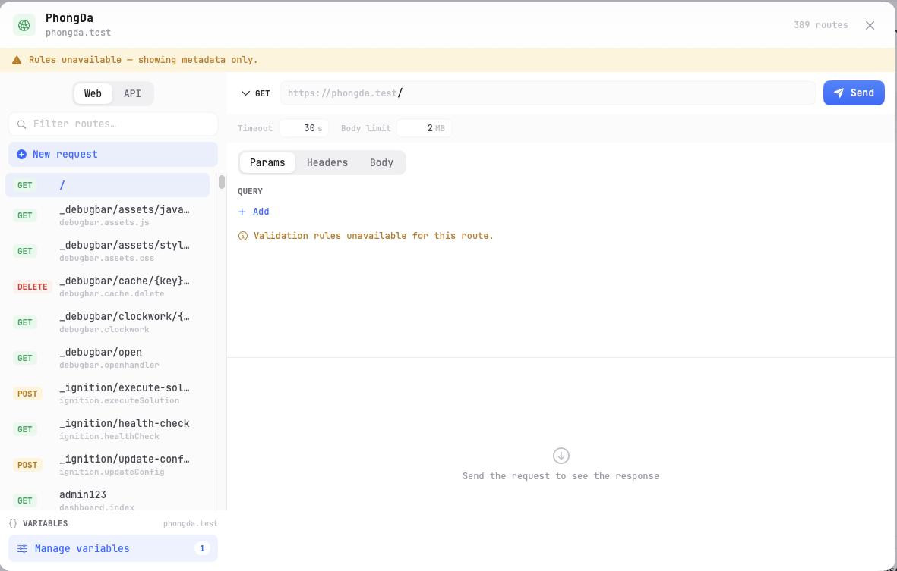

# 12 — API Tester

The API Tester is a built-in tool for building and sending HTTP requests to your site. It works like Postman or Insomnia, but runs right inside KTStack without leaving the app.

## Opening the API Tester

1. Click the KTStack menu-bar icon and open the dashboard.
2. Go to the **Sites** section.
3. Find the site you want to test and click its **API Tester** button (a network icon, or shown in the site's action menu).
4. A modal window opens showing the API Tester interface.



## Building a request

The API Tester has three main sections: route selection (left), request builder (top-right), and response viewer (bottom-right).

### Choosing what to test

**If your app is a REST API** (like a Laravel or Node API with defined routes):
- The left sidebar lists all routes detected in your app
- Click a route to load it
- The method, path, and any URL parameters are filled in automatically

**If your app is a standard web app** (not a REST API):
- The API Tester switches to "REST client" mode
- You manually enter the method and URL

### Setting the HTTP method

At the top of the request panel:
1. Click the **method dropdown** (GET, POST, PUT, DELETE, PATCH, HEAD, OPTIONS, etc.)
2. Select the method you want to use

| Method | Purpose |
|--------|---------|
| **GET** | Fetch data (no body) |
| **POST** | Create new data (with body) |
| **PUT** | Replace existing data (with body) |
| **PATCH** | Partially update data (with body) |
| **DELETE** | Remove data |
| **HEAD** | Like GET, but no response body |

### Setting the URL

1. In the **URL field**, type the path you want to request (e.g., `/api/users` or `/admin/dashboard`).
2. If the path has parameters (e.g., `/api/users/{id}`), type the actual ID (e.g., `/api/users/5`).
3. You can use variables in the URL (see [Variables](#variables) below).

The URL is relative to your site's domain. KTStack automatically prepends `https://[site-name].test`.

### Adding headers

Headers are key-value pairs sent with every HTTP request (like `Content-Type` or `Authorization`).

1. In the request panel, find the **Headers** section.
2. Click **Add header** or **+** to create a new row.
3. Type the header name (left column) and value (right column).
4. Common headers show a **dropdown** for quick selection (e.g., `Content-Type: application/json`).
5. Click the **X** on any header row to remove it.

Typical headers:
- `Content-Type: application/json` — tells the server you're sending JSON in the body
- `Accept: application/json` — tells the server you expect JSON in the response
- `Authorization: Bearer <token>` — authentication token for protected endpoints

### Building a request body

If you're using POST, PUT, or PATCH, you can send data to the server.

**Key-value form** (default for most requests):
1. In the request panel, find the **Body** section.
2. The body is shown as a **form** with key-value rows.
3. Click **Add field** or **+** to add a new field.
4. Type the key (left column) and value (right column).
5. Click **X** to remove a field.

Example:
```
name       | John
email      | john@example.com
is_admin   | false
```

**Raw body** (for complex JSON, XML, or custom data):
1. Toggle **Raw** or click the mode switch in the Body section.
2. Paste or type your JSON, XML, or other content directly.
3. Remember to set the `Content-Type` header to match (e.g., `application/json` or `application/xml`).

The API Tester sends form data as `application/x-www-form-urlencoded` unless you use raw body mode.

### Variables

Variables let you reuse values across requests without typing them repeatedly.

**Using a variable in a request**:
1. Anywhere in the URL, headers, or body, type `{{variable-name}}` (e.g., `{{user-id}}` or `{{api-token}}`).
2. When you send the request, KTStack recognizes `{{variable-name}}` and prompts you to enter its value.

**Managing variables**:
1. Click the **Variables** button (usually a settings or gear icon in the request panel).
2. A sheet appears showing all variables used in this request.
3. Enter or update values (e.g., user-id: 42, api-token: secret123).
4. Click **Close** or **Save**.
5. Variables are **remembered for this session** so you don't retype them on the next request.

Example workflow:
- Define `{{user-id}}` as 5
- Use it in multiple requests: `/api/users/{{user-id}}`, `/api/users/{{user-id}}/posts`, etc.
- Change the variable to 10 and all requests automatically use the new value

## Sending a request

1. Make sure your request is complete (method, URL, headers, body as needed).
2. Click the **Send** button (large blue button or arrow icon) at the top of the request panel.
3. A progress indicator appears while the request is in flight.
4. The response appears in the bottom panel.

## Reading the response

The response viewer shows:

**Status line** (top):
- The HTTP status code (e.g., 200, 404, 500) with a color-coded badge
- The status text (e.g., "OK", "Not Found", "Internal Server Error")

**Response headers** (first tab or section):
- All headers sent back by the server
- Common headers: `Content-Type` (format of the body), `Content-Length` (size), `Set-Cookie` (session data), etc.

**Response body** (second tab or section):
- The actual data returned by the server
- If it's JSON, it is formatted and easy to read
- If it's HTML, you see the raw markup
- If it's plain text, you see it as-is

**Status codes at a glance**:
- 🟢 **2xx** (green) — Success. The request worked.
- 🟡 **3xx** (yellow) — Redirect. The server sent you elsewhere.
- 🔴 **4xx** (red) — Client error. Your request was malformed (bad URL, missing field, etc.).
- 🔴 **5xx** (red) — Server error. The app crashed or something went wrong on the server.

## Saving and reusing requests

If your app has a REST API with defined routes, requests are automatically saved and listed in the left sidebar. Click any route to load it again.

For generic REST client mode (non-API apps), the request panel remembers your last request in the current session. Close and reopen the modal to start fresh.

## Tips and notes

- **Test before deploying**: Use the API Tester to verify your endpoints work before pushing code.
- **No persistence**: Requests are not saved to disk. Reload the app and your request history is gone (but routes are still listed if you have a REST API).
- **Headers case-sensitive?**: HTTP header names are case-insensitive, but values are case-sensitive. `Content-Type: application/json` and `content-type: application/json` are equivalent in the header name.
- **JSON formatting**: If your response body is JSON but looks jumbled, the API Tester tries to auto-format it for readability.
- **Cookies and sessions**: If the server sets a cookie, it's stored by KTStack and sent on future requests in the same session (just like a browser).
- **Timeout**: Requests that take more than 30 seconds are automatically cancelled.

## Common tasks

### Testing a login endpoint

1. **First request**: POST to `/api/auth/login` with username and password in the body.
2. **Copy the token**: From the response, find the `token` or `access_token` field and copy it.
3. **Set a variable**: Click Variables and set `{{api-token}}` to the token value.
4. **Second request**: GET `/api/me` with header `Authorization: Bearer {{api-token}}` to verify you're logged in.

### Testing pagination

1. **First request**: GET `/api/posts?page=1&limit=10`.
2. **Check the response**: Look for a `next_page_url` or `has_more` field.
3. **Second request**: GET `/api/posts?page=2&limit=10` (or use the `next_page_url` if provided).
4. **Repeat** until `has_more` is false or `next_page_url` is null.

### Testing file uploads

Use raw body mode and set `Content-Type: multipart/form-data` (if your API supports it). For most standard forms, switch from raw body to key-value form and the API Tester handles encoding.

## Troubleshooting

| Problem | Solution |
|---------|----------|
| 404 Not Found | Check that the path is correct and the server is running. Verify in the Nginx access log. |
| 500 Internal Server Error | The app crashed. Check the site's error log or the Logs section. |
| Headers are ignored | Make sure the header key and value are both filled in. Click Add header if a row is empty. |
| Variables not working | Use the exact format `{{variable-name}}` (double braces). Check that the variable is defined in the Variables sheet. |
| Authentication failing | Verify the token is correct, not expired, and using the right format (Bearer token, API key, etc.). |
| Response is empty | Some endpoints return no body (e.g., 204 No Content). Check the status code; 2xx is still a success. |

## Where to go next

Now that you can test APIs, head to [13 — Sharing with Cloudflare Tunnel](13-sharing-cloudflare-tunnel.md) to expose your site to the internet for testing with others.
