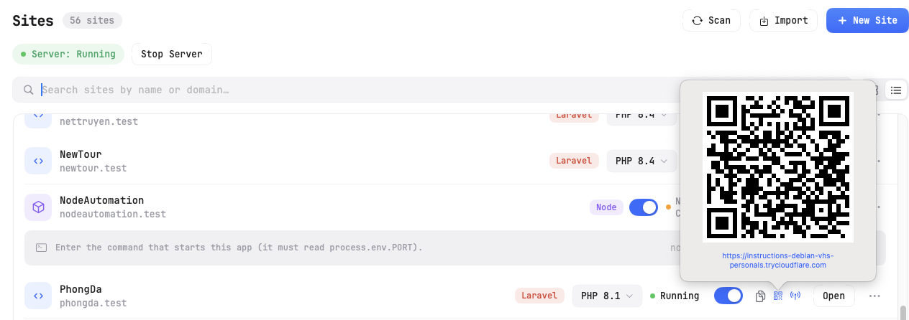

# 13 — Sharing with Cloudflare Tunnel

KTStack can expose any of your local sites to the internet using Cloudflare Tunnel, without opening ports or complex configuration. Share a temporary public URL and QR code with anyone, instantly.

## What is Cloudflare Tunnel?

Cloudflare Tunnel (formerly Argo Tunnel) is a free service from Cloudflare that creates a secure tunnel from your Mac to the internet. Instead of telling people your local IP address (which doesn't work across the internet anyway), you get a temporary public URL like `https://grateful-dog-123.trycloudflare.com` that routes to your local site.

**Why use it?**
- **No port forwarding** — no need to mess with your router
- **Secure HTTPS** — Cloudflare handles the certificate
- **Works from anywhere** — share the URL with someone and they can visit your site as if it were live
- **Temporary** — the URL lasts only as long as the tunnel is open
- **Free** — Cloudflare offers free Tunnel for development

## Requirements

Before sharing a site, make sure:

1. **The site is running** — it must be reachable at `https://[site-name].test` from your Mac
2. **Cloudflare Tunnel binary is installed** — KTStack includes the `cloudflared` binary for tunneling
3. **Internet connection** — your Mac needs to connect to Cloudflare's servers

If the binary is missing or outdated, KTStack prompts you to download it when you try to share.

## Enabling a tunnel for a site

1. Open KTStack and go to the **Sites** section.
2. Find the site you want to share and look for the **sharing controls** (antenna or network icons in the site's card).
3. If sharing is **off**, you see an icon showing "Share via tunnel" — click it.
4. KTStack starts the tunnel. A progress spinner appears while it connects.
5. Once ready, the spinner is replaced with a **public URL** (e.g., `https://grateful-dog-123.trycloudflare.com`).

## Using the shared URL

Once a tunnel is active, you have three options:

### Copy the URL

Click the **copy button** (document icon) next to the URL. The URL is copied to your clipboard. You can now:
- Share it in chat, email, or a meeting
- Open it in a browser yourself to test
- Bookmark it temporarily

### Show a QR code

Click the **QR code button** (or icon showing a QR square) to display a QR code. Others can scan it with their phone camera and the site opens immediately. This is perfect for:
- Quick demos
- Mobile testing from a colleague's phone
- Showing clients the work in progress

The QR code contains the full URL and remains visible as long as the tunnel is open.

### Stop sharing

Click the **stop sharing button** (antenna with a slash, or "Stop" label) to close the tunnel. The public URL becomes invalid immediately. Anyone who has the URL can no longer access your site.

## How long does sharing last?

The tunnel stays active **as long as KTStack is running and the toggle remains on**. Once you close KTStack or toggle sharing off, the tunnel closes and the URL expires.

**Restart and new URL**: If you stop sharing and start again, you get a **new random URL** each time. Cloudflare doesn't guarantee the same URL on the next tunnel.

## What others see

When someone visits your shared URL:
- They see your site exactly as it appears at `https://[site-name].test`
- They see browser-trusted HTTPS (green lock icon) because Cloudflare's certificate is valid
- They can test forms, APIs, and all interactive features
- **They cannot see your local file system or access anything outside the site**

## HTTPS and certificates

Cloudflare Tunnel automatically handles HTTPS for the public URL. You don't need to do anything — it just works. The certificate is issued by Cloudflare and is trusted by all browsers.

Your local site at `https://[site-name].test` also has a local certificate (issued by KTStack's local certificate authority). The tunnel bridges these two, so everything is encrypted end-to-end.

## Tips and notes

- **No account needed**: You don't need to create a Cloudflare account. Free Tunnel works without signing in.
- **Multiple sites**: You can run multiple tunnels at once, each with its own URL.
- **Performance**: Tunnel adds a small delay (latency) as traffic goes through Cloudflare's servers. It's fine for testing but not suitable for load testing or benchmarking.
- **Bandwidth**: Cloudflare doesn't cap free Tunnel bandwidth, but they reserve the right to limit it if usage is abusive.
- **Logs**: Cloudflare doesn't log your traffic by default. Your data is private.
- **Expiration**: Free Tunnel sessions typically last 24 hours, but may be reset sooner if Cloudflare needs to perform maintenance.

## Common workflows

### Quick client demo

1. Finish your work and enable sharing for the site.
2. Copy the URL and send it to the client.
3. They visit the URL and see the live demo.
4. When done, toggle sharing off.

### Mobile testing

1. Enable sharing for your site.
2. Click the QR code button.
3. Scan the QR code from your phone.
4. Your site opens in the phone's browser for testing.

### Team review before deployment

1. Enable sharing for the staging site.
2. Post the URL in your team Slack channel.
3. Everyone opens the link and reviews the feature.
4. After approval, deploy to production.

## Troubleshooting

| Problem | Solution |
|---------|----------|
| "Starting tunnel…" never finishes | Check your internet connection. The Cloudflare service may be temporarily down. Restart KTStack or toggle sharing off and on again. |
| "Tunnel error" or "Connection refused" | Make sure the site is running and reachable at `https://[site-name].test`. Open the site locally first, then enable sharing. |
| "cloudflared binary not found" | KTStack needs the tunnel binary. Click the error message to download it, or restart KTStack. |
| URL works for me but not for others | Make sure you sent the full URL (starting with `https://`). If the URL is very old, it may have expired — restart the tunnel to get a new one. |
| "Too many tunnels open" | You have more than a few tunnels running at once. Close some tunnels by toggling sharing off for other sites. |

## Privacy and security

**What is shared?**
- Only the public URL you share. Anyone with it can access your site.

**What is not shared?**
- Your local IP address
- Your router or other devices on your network
- Files outside the site directory
- Anything not accessible through the site's web interface

**Best practices:**
- Don't share the URL publicly on social media or in forums (it's temporary but still accessible)
- Only share with people you trust
- Test sensitive features (like login) locally first before sharing with others
- For production sites, use Cloudflare's full service (not free Tunnel) with proper authentication and rate limiting

## Where to go next

Now that you can share your site, head to [14 — Xdebug & debugging](14-xdebug-and-debugging.md) to step through your PHP code with a debugger.
