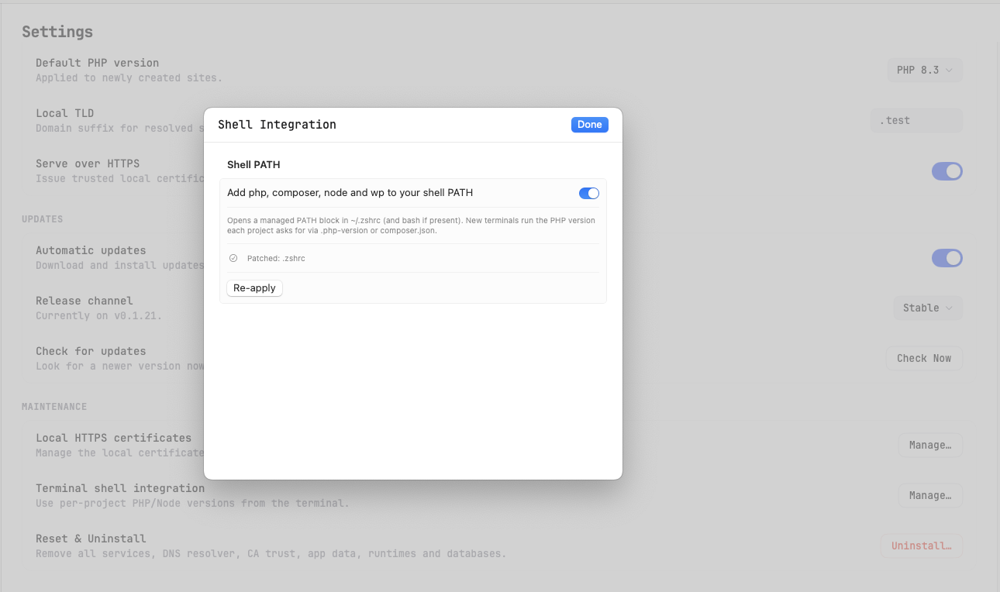

# 15 — Shell Integration

Shell integration allows you to run the same `php`, `node`, `composer`, and `wp` commands from your Mac's terminal that KTStack uses in your sites — with per-project version selection automatically handled.

## What is shell integration?

When you open a terminal and type `php -v`, you usually run the system's default PHP (or one installed via Homebrew). Shell integration replaces those commands with KTStack-managed versions that respect per-project settings.

**Without shell integration:**
```bash
$ php -v
PHP 7.2.0 (from /usr/local/bin/php)  # System default, not what your project needs
```

**With shell integration:**
```bash
$ cd ~/projects/myapp   # My Laravel app needs PHP 8.3
$ php -v
PHP 8.3.0 (from KTStack)  # Automatically matched to the project

$ cd ~/projects/oldapp  # My legacy app needs PHP 7.4
$ php -v
PHP 7.4.0 (from KTStack)  # Automatically matched to the project
```

## How it works

KTStack uses a **version marker system**:
- Each project specifies its PHP/Node version in `.php-version` or `composer.json`
- When you `cd` into a project, a shell script reads these markers
- The script selects the right version from KTStack
- All `php`, `node`, `composer`, and `wp` commands run that version

## Enabling shell integration

1. Open KTStack and go to **Settings** (or menu bar).
2. Look for **Maintenance** or **Shell PATH** section.
3. Find the toggle: **"Add php, composer, node and wp to your shell PATH"**.
4. Toggle it **on**.

KTStack prompts you to confirm (it's about to edit your `~/.zshrc` and possibly `~/.bash_profile`).



KTStack shows which shells it patched (e.g., "Patched: zsh, bash").

## What shell integration does

When you enable it, KTStack:
1. Finds your shell config file (`~/.zshrc` for zsh, `~/.bash_profile` for bash)
2. Adds a block of code that creates aliases and helper functions for `php`, `node`, `composer`, and `wp`
3. Creates/updates a `.zshenv` or `.bashenv` file to load KTStack's PATH on every new terminal

**The changes are safe:**
- They're wrapped in a clear section: `# START KTStack Shell Integration` ... `# END KTStack Shell Integration`
- You can delete this section anytime to disable integration
- Other tools and commands are unaffected

## Verifying shell integration works

1. **Close all open terminals** (so they reload the config).
2. **Open a new terminal**.
3. **Type:** `php -v`
4. **Expected output:** Should show a PHP version from KTStack (e.g., "PHP 8.3.0-KTStack").

If you see your system PHP (e.g., "PHP 7.2.0"), integration may not be active. Try:
```bash
source ~/.zshrc   # Reload the config manually
php -v            # Try again
```

## Per-project version selection

Once shell integration is active, KTStack automatically picks the right version for each project.

### Using `.php-version` (recommended for consistency)

The simplest way to set a PHP version per project:

1. In your project root, create a file named `.php-version`.
2. Write a single line with the version number (e.g., `8.3` or `8.3.0`).
3. Save the file.

Example:
```
$ cd ~/projects/myapp
$ echo "8.3" > .php-version
$ php -v
PHP 8.3.0 (from KTStack)
```

### Using `composer.json` (Laravel, Symfony, etc.)

If your `composer.json` specifies a PHP version, KTStack respects it:

```json
{
    "require": {
        "php": "^8.3"
    }
}
```

The shell integration reads the version constraint and picks the nearest match from KTStack's installed versions.

### Version resolution order

When you run `php` in a project folder, KTStack checks (in order):

1. **`.php-version`** in the current folder (highest priority)
2. **`.php-version`** in parent folders (walking up the tree)
3. **`composer.json`** in the current folder
4. **`composer.json`** in parent folders
5. **Default version** set in KTStack (if no markers found)

This means:
- Nested projects are supported (a subfolder can override the parent's version)
- You only need one `.php-version` at the root if all subfolders use the same version
- Projects without markers fall back to your default

## Switching versions for a project

To change which PHP version a project uses:

1. Edit (or create) `.php-version` in the project root.
2. Change the version number (e.g., from `8.2` to `8.3`).
3. Save the file.
4. Open a **new terminal window** (or run `source ~/.zshrc` in the current one).
5. Verify: `php -v` shows the new version.

No restart of KTStack needed — the shell picks it up immediately on the next terminal session.

## Node.js and other languages

The same per-project approach works for Node:

1. Create `.node-version` in your project root with the version (e.g., `18.0` or `20.0`).
2. When you `cd` into the project, `node -v` and `npm` use that version.

## Using wp-cli (WordPress)

If you have the `wp` command enabled via shell integration:

```bash
$ wp --version
WP-CLI x.x.x
```

The `wp` command runs under the same PHP version as your project. Set `.php-version` just like with `php`.

## Removing shell integration

If you want to stop using KTStack's PHP/Node in your terminal:

1. Open **Settings > Maintenance > Shell PATH** in KTStack.
2. Toggle the switch **off**.
3. KTStack removes the integration block from your shell config.
4. Close and reopen your terminal.

Verify: `php -v` should now show your system PHP (or Homebrew's).

Your project files (`.php-version`, `composer.json`, etc.) are untouched, so you can re-enable integration later without reconfiguring.

## Tips and notes

- **Slow terminal startup?** If adding KTStack integration slowed down terminal startup, check that the shell config file isn't loading too many heavy tools. The KTStack block is small and shouldn't add noticeable delay.
- **Multiple projects, one version?** You can set a **default version** in KTStack Settings so projects without `.php-version` use it. See [04 — PHP & runtimes](04-php-and-runtimes.md).
- **Composer and wp-cli?** Shell integration also patches `composer` and `wp` commands. They run under the selected PHP version automatically.
- **Works with git hooks?** Yes — if you have a git hook that runs `php` or `node`, it will use the project's selected version when you're in that project folder.
- **Bash and zsh?** Shell integration works with both. KTStack patches whichever is installed.
- **Fish shell?** Currently not supported. If you use Fish, you can manually set the PATH to include KTStack's bins (`~/Library/Application Support/KTStack/bin/php`, etc.), or file a GitHub issue requesting Fish support.

## Common tasks

### Check which PHP is running

```bash
$ which php
/Users/yourname/Library/Application Support/KTStack/bin/php

$ php -v
PHP 8.3.0 (from KTStack)
```

### Run a one-off command with a different version

If your project uses PHP 8.2 but you need to test with 8.3:

```bash
$ php --version   # Shows 8.2
$ /path/to/ktstack/bin/php-8.3 script.php   # Run directly with 8.3
```

(The path is shown in KTStack's settings.)

### Verify composer is using the right version

```bash
$ composer --version
# or
$ composer diagnose   # Shows PHP version used by Composer
```

### Set a version for an entire folder of projects

Instead of `.php-version` in each project, create one in a parent folder:

```bash
$ cd ~/projects
$ echo "8.3" > .php-version

$ cd ~/projects/app1
$ php -v   # Uses 8.3

$ cd ~/projects/app2
$ php -v   # Uses 8.3

$ cd ~/projects/legacy
$ echo "7.4" > .php-version
$ php -v   # Uses 7.4 (overrides parent)
```

## Troubleshooting

| Problem | Solution |
|---------|----------|
| `php` still shows system version after enabling integration | Close all terminal windows and open a new one. The shell config is only read on startup. |
| "command not found: php" after enabling integration | Make sure KTStack is running and the PHP version is installed. Check that the `.zshrc` file was actually modified (open it in an editor and look for "KTStack" comment). |
| Shell integration toggle shows "Patched: zsh" but I use bash | KTStack detected zsh but you may have both. Edit `~/.bashrc` or `~/.bash_profile` manually and add the same block as zsh, or re-apply the integration from KTStack. |
| Composer download didn't finish warning | KTStack was downloading the `composer` binary to bundle with shell integration. Click **Re-apply** in Settings to retry. |
| Project version not detected | Make sure `.php-version` is in the **project root** (same folder as `composer.json` or `.git`), not a subfolder. Check that the version in the file matches an installed version (e.g., `8.3`, not `8.3.0-beta`). |
| Different PHP version in terminal than in KTStack dashboard | They're independent. Your terminal uses `.php-version` or `composer.json`. Your sites in KTStack use the version you picked in the UI. They can differ. To align them, edit `.php-version` to match the site's version. |

## Where to go next

You now have shell integration set up! Return to [16 — Settings & preferences](16-settings-and-preferences.md) to explore other customization options, or jump to [18 — Troubleshooting & FAQ](18-troubleshooting-and-faq.md) if you hit any issues.
